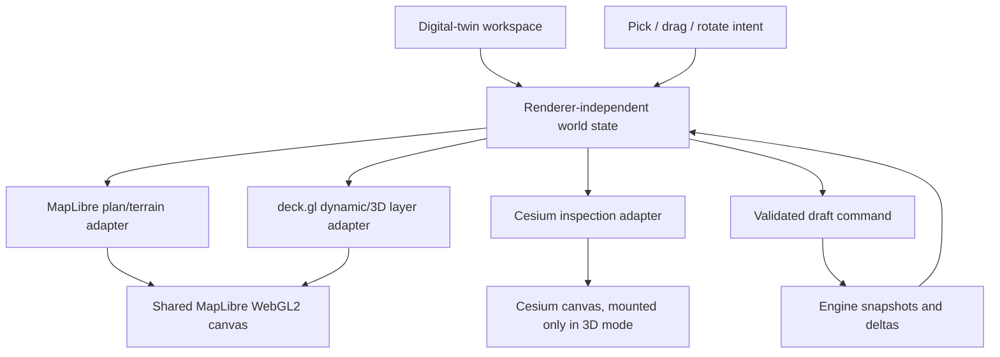

# Main map and 3D digital-twin rendering architecture

**Research date:** 2026-08-07  
**Status:** Recommendation for an implementation spike; not yet an ADR  
**Scope:** Browser rendering architecture for satellite imagery, terrain, 3D
models, large point clouds, direct asset manipulation, and live simulation
state.

## Executive recommendation

Keep **MapLibre GL JS as the primary map and camera**, use **deck.gl in
interleaved mode for high-volume and fast-changing asset layers**, and keep
**CesiumJS behind the existing in-place 3D renderer adapter** for scenes where
native 3D Tiles, globe-scale precision, or Cesium's mature tile cache materially
outperform the MapLibre path.

For the first working slice, do not introduce a new rendering framework. This
repository already ships MapLibre, Cesium, deck.gl, loaders.gl, Three.js,
`maplibre-gl-3d-tiles`, and LiDAR integrations. The smallest end-to-end route is:

1. MapLibre renders satellite/raster data, vector context, labels, and DEM
   terrain.
2. A single shared deck.gl `MapboxOverlay({interleaved: true})` renders dynamic
   utility assets, instanced glTF models, conductors, analysis overlays, and one
   chosen 3D Tiles/point-cloud backend.
3. Selection and drag gestures update a renderer-independent draft object.
   MapLibre owns pointer gestures; the application calls deck's explicit picking
   methods because `MapboxOverlay` disables deck's controller. Rendering adapters
   only return stable object hits and visual previews.
4. The Engine remains authoritative for topology, collisions, cable physics,
   vegetation interaction, and scenario results. The browser interpolates and
   renders streamed state; it does not become the system-of-record simulator.
5. Cesium remains an in-place 3D mode using the same `WorldObjectId`, selection,
   time, and camera target. It is not a second product or a second state model.

This is a layered architecture, not a bet that one renderer can do everything:

The strongest greenfield alternative is **Giro3D**. It is unusually well
matched to a local or regional twin: it combines imagery, elevation, 3D Tiles,
Potree, LAS/LAZ/COPC, glTF, local CRSs, picking, and direct Three.js access in
one MIT-licensed framework. It should be included in the benchmark spike, but
replacing this project's working MapLibre/Cesium/deck stack before a measured
win would add migration risk without removing the hard parts: identity,
authoritative editing, simulation contracts, and data preprocessing.

## What the requirement actually implies

The visual references combine four different workloads:

- **Geospatial context:** satellite imagery, roads, parcels, labels, and terrain.
- **Survey evidence:** dense LiDAR/photogrammetry point clouds that must stream
  progressively and retain classification/intensity metadata.
- **Semantic assets:** poles, conductors, equipment, structures, and vegetation
  with stable identity and attributes.
- **Time-varying results:** utilization, sag, clearance, wind, temperature,
  collision, fire, and intervention previews.

Those workloads have different update rates and storage formats. Treating every
tree, LiDAR point, and simulated cable vertex as one React object or one GeoJSON
feature collection would make loading and live updates needlessly expensive.

The requirement that assets "interact with each other" is not a renderer
feature. Rendering libraries provide cameras, drawing, picking, animation, and
sometimes collision queries. Network topology, constraints, physics, scenario
validation, and authoritative persistence belong in the Engine. The viewer
needs a state bridge that can apply ordered snapshots/deltas and preserve object
identity across level-of-detail and renderer changes.

The current product requirements already point in this direction:
`FR-020` through `FR-028` require WGS84 placement, stable selection, matching
renderers per format, 50,000 trees, faithful dimensions, and independently
controlled terrain, point clouds, imagery, vegetation, structures, conductors,
and overlays. The UI specification also says Plan and 3D are peer views with
selection continuity rather than separate products.

## Current repository position

This is not a greenfield renderer decision:

- [`apps/geolibre-desktop/package.json`](../../apps/geolibre-desktop/package.json)
  already depends on MapLibre 5.24, deck.gl 9.3, Cesium 1.143, Three.js 0.185,
  `maplibre-gl-3d-tiles`, and LiDAR/USGS LiDAR plugins.
- [`packages/map/package.json`](../../packages/map/package.json) already owns
  MapLibre and Cesium.
- `MapCanvas`, `CesiumCanvas`, and `MapGrid` already establish renderer and
  camera seams.
- The existing 3D Tiles plugin already uses deck.gl for Google Photorealistic
  3D Tiles and contains restoration/lifecycle paths for 3D Tiles and I3S.
- [`docs/digital-twin-first-party-platform-plan.md`](../digital-twin-first-party-platform-plan.md)
  already proposes small MapLibre, Cesium, deck.gl, and Three adapters rather
  than leaking renderer objects into the domain.

MapLibre 6 was released in July 2026 and is ESM-only, WebGL2-only, and contains
breaking API/style changes. The current 5.24 pin is also the version used by
MapLibre's current official 3D Tiles example. Viewer work and a v6 migration
should be separate measured changes, not one combined cutover.
[MapLibre v6 release notes](https://github.com/maplibre/maplibre-gl-js/releases)

## Decision matrix

Scores are architectural fit for this repository, not generic library quality.
`5` is the best fit. "Editing" means the primitives needed to build a safe
domain editing workflow, not authoritative multi-user persistence.

| Candidate | Imagery / terrain | Massive 3D / point cloud | Picking / moving assets | Live updates | Regional/local fit | Repo fit | Verdict |
| --- | ---: | ---: | ---: | ---: | ---: | ---: | --- |
| MapLibre + deck.gl | 5 | 4 | 4 | 5 | 5 | 5 | **Primary path** |
| MapLibre + custom Three.js | 5 | 4 | 5 | 4 | 5 | 5 | Use only for gaps that deck.gl cannot cover |
| CesiumJS | 5 | 5 | 3 | 4 | 4 | 5 | **3D adapter and benchmark baseline** |
| Giro3D | 5 | 5 | 5 | 4 | 5 | 2 | Best greenfield challenger; benchmark, do not migrate yet |
| Pure Three.js / R3F | 2 | 4 | 5 | 5 | 5 | 3 | Excellent scene engine, expensive GIS rebuild |
| Potree / Potree2 | 1 | 5 | 3 | 2 | 5 | 2 | Specialist point-cloud inspector only |
| iTowns | 4 | 4 | 4 | 3 | 5 | 1 | Superseded for this decision by Giro3D |
| OpenLayers + Three.js | 4 | 3 | 5 | 4 | 5 | 1 | Giro3D is the maintained packaged version of this idea |
| iTwin.js | 4 | 5 | 4 | 4 | 5 | 1 | Strong if adopting the iModel/Bentley platform; otherwise oversized |
| xeokit | 2 | 4 | 4 | 3 | 5 | 1 | BIM-focused; AGPL/commercial license decision required |
| NASA WebWorldWind | 4 | 2 | 3 | 3 | 2 | 1 | Do not select for a new 2026 implementation |
| ArcGIS Maps SDK for JS | 5 | 5 | 5 | 4 | 5 | 1 | Strong commercial alternative, but introduces platform/service coupling |

## Detailed findings

### 1. MapLibre GL JS: keep it as the map foundation

MapLibre is a GPU-accelerated interactive map renderer with vector/raster tile,
GeoJSON, terrain, labels, styling, and map interaction APIs. Its official
examples now cover raster satellite maps, hybrid satellite plus DEM terrain,
COGs, realtime feature updates, Three.js models on terrain, and Three.js-based
3D Tiles. [MapLibre examples](https://maplibre.org/maplibre-gl-js/docs/examples/)

Its `CustomLayerInterface` is the critical seam: a custom layer draws directly
into MapLibre's WebGL context with MapLibre's camera; `renderingMode: "3d"`
shares the depth buffer with regular map layers. The contract also requires
custom code to restore GL state correctly and handle context loss, which is why
one well-owned integration layer is preferable to many plugins independently
touching the context.
[MapLibre custom layer contract](https://maplibre.org/maplibre-gl-js/docs/API/interfaces/CustomLayerInterface/)

MapLibre itself is not a full 3D scene graph and does not natively supply
translate/rotate/scale gizmos, physics, or a point-cloud LOD pipeline. Its
official 3D Tiles example composes MapLibre with Three.js and a separate 3D
Tiles renderer; that is evidence for an extension seam, not evidence that all
3D concerns should be implemented inside MapLibre.
[MapLibre 3D Tiles example](https://maplibre.org/maplibre-gl-js/docs/examples/add-3d-tiles-using-threejs/)

For high-frequency semantic feature updates, `GeoJSONSource.updateData` can
apply ID-based diffs faster than replacing a large source, but it still implies
worker-side GeoJSON processing. Use it for moderate plan layers and edits, not
for per-frame multi-million-item simulation.
[MapLibre `GeoJSONSource.updateData`](https://maplibre.org/maplibre-gl-js/docs/API/classes/GeoJSONSource/)

**License and maintenance:** MapLibre GL JS is BSD-3-Clause and has active 2026
releases. [License](https://github.com/maplibre/maplibre-gl-js/blob/main/LICENSE.txt)

### 2. deck.gl + loaders.gl: best dynamic layer compositor

deck.gl integrates with MapLibre in **interleaved** mode by rendering into the
same WebGL2 context. This permits correct 3D occlusion and lets deck layers sit
between MapLibre layers such as terrain and labels. Interleaving requires
MapLibre greater than v3 and WebGL2, which this project already satisfies.
[Official MapLibre integration](https://deck.gl/docs/developer-guide/base-maps/using-with-maplibre)

Relevant layers include:

- `ScenegraphLayer` for many instances of the same glTF scene, including glTF
  animation and picking.
  [ScenegraphLayer](https://deck.gl/docs/api-reference/mesh-layers/scenegraph-layer)
- `PathLayer`, `LineLayer`, and custom layers for spans, conductors, clearance
  envelopes, wind vectors, and physics result geometry.
- `Tile3DLayer` for 3D Tiles or I3S. It selects a `ScenegraphLayer`,
  `PointCloudLayer`, or `SimpleMeshLayer` according to tile content and shares
  one tile cache across views.
  [Tile3DLayer](https://deck.gl/docs/api-reference/geo-layers/tile-3d-layer)
- `PointCloudLayer` for bounded point clouds or LAS/LAZ loaded through
  loaders.gl. A single LAS/LAZ file is not a substitute for a spatially tiled
  production dataset.

deck.gl provides GPU picking plus `onClick`, `onDragStart`, `onDrag`, and
`onDragEnd` when its own controller handles input. That is not the integration
used here: `MapboxOverlay` always disables the deck controller and delegates
interaction to MapLibre. The map adapter should therefore listen to MapLibre
pointer events, call `overlay.pickObject(...)`, temporarily disable conflicting
map gestures, and update draft position/orientation. 3D picking can return a
coordinate on actual geometry, with a documented performance cost.
[deck.gl interactivity](https://deck.gl/docs/developer-guide/interactivity)
[MapboxOverlay input and picking contract](https://deck.gl/docs/api-reference/mapbox/mapbox-overlay)

The main realtime caveat is data invalidation. Replacing a layer's entire data
array rebuilds GPU buffers and can visibly stutter at surprisingly modest live
update sizes. deck.gl recommends stable data, `updateTriggers`, binary data,
workers, and externally supplied typed-array/GPU attributes for heavy,
high-frequency updates. This maps well to Engine-published deltas and a worker
that batches changed asset ranges once per animation frame.
[deck.gl performance guidance](https://deck.gl/docs/developer-guide/performance)

The official performance page reports fluid rendering around one million basic
items on its stated older reference laptop, but also warns that full layer data
changes can take seconds and that contiguous browser allocations eventually
fail. Those figures are directional, not acceptance criteria for this product.
We must benchmark our shaders, point sizes, terrain, imagery, and picking on the
actual reference hardware.

loaders.gl is useful plumbing, not the scene architecture. Its 3D Tiles loader
loads only tiles selected for the viewport, but does not stream the contents of
an individual tile. Its LAS loader documents support only through LAS 1.3.
[Tiles3DLoader](https://loaders.gl/docs/modules/3d-tiles/api-reference/tiles-3d-loader)
[LAS module](https://loaders.gl/docs/modules/las)

**License and maintenance:** deck.gl/loaders.gl are MIT-licensed OpenJS/vis.gl
projects with current 2026 documentation and releases.
[deck.gl repository](https://github.com/visgl/deck.gl)

### 3. Three.js and 3DTilesRendererJS: use as a surgical escape hatch

Three.js is the best low-level option when the viewer needs custom mesh
generation, bespoke shading, full scene-graph control, or familiar 3D editing
gizmos. `Raycaster` supports object/point/instance picking;
`TransformControls` provides translate/rotate/scale controls; and
`InstancedMesh` reduces draw calls for repeated geometry while retaining
per-instance transforms and colors.
[Raycaster](https://threejs.org/docs/pages/Raycaster.html)
[TransformControls](https://threejs.org/docs/pages/TransformControls.html)
[InstancedMesh](https://threejs.org/docs/pages/InstancedMesh.html)

NASA AMMOS's `3DTilesRendererJS` is an Apache-2.0 renderer for Three.js,
Babylon.js, and React Three Fiber. It supports most 3D Tiles features and has
plugins/examples for Cesium ion, Google Photorealistic Tiles, WMS/WMTS/XYZ,
quantized mesh, GeoJSON, vector tiles, and regional loading. Its changelog shows
active releases through May 2026.
[3DTilesRendererJS repository](https://github.com/NASA-AMMOS/3DTilesRendererJS)
[Changelog](https://github.com/NASA-AMMOS/3DTilesRendererJS/blob/master/CHANGELOG.md)

Do not make a second full Three.js canvas the default map. A pure Three/R3F
viewer would require this team to rebuild map tile selection, cartographic
projection and precision handling, terrain/imagery draping, labels,
attribution, map controls, source lifecycle, styling, and GIS picking.

React Three Fiber is ergonomic for React-owned scenes, but its own performance
guide warns against mounting/unmounting objects in hot paths and recommends
instancing and mutation inside the render loop for fast updates. It does not
make thousands of JSX asset nodes a good architecture.
[R3F performance pitfalls](https://r3f.docs.pmnd.rs/advanced/pitfalls)

Use a MapLibre custom Three layer only when a measured requirement cannot be
expressed cleanly in deck.gl—for example a selected object's DCC-style transform
gizmo or a specialized deforming mesh. Never render the same dataset through
both deck.gl and Three.js at once.

### 4. CesiumJS: strongest 3D Tiles engine, not the only product renderer

CesiumJS combines imagery, dynamically selected terrain, glTF models, time-aware
entities, 3D Tiles, point-cloud styling, picking, and explicit 3D Tiles cache
budgets. Terrain and imagery are independent and higher resolution terrain is
requested according to the current view.
[Cesium terrain](https://cesium.com/learn/cesiumjs-learn/cesiumjs-terrain/)

`Cesium3DTileset` exposes `maximumScreenSpaceError`, `cacheBytes`, overflow
headroom, and memory reporting; offscreen tiles are unloaded to enforce the
cache. This is the most complete off-the-shelf candidate for very large 3D
Tiles and should be the comparison baseline for the point-cloud/photogrammetry
scene.
[Cesium3DTileset memory and LOD](https://cesium.com/learn/cesiumjs/ref-doc/Cesium3DTileset.html)

Cesium supports feature and world-position picking, and its Entity API has
stable IDs, position/orientation properties, arbitrary properties, availability
intervals, glTF models, and tilesets. It does not provide a complete utility
asset authoring workflow; dragging and validation still need product code.
[Entity API](https://cesium.com/learn/cesiumjs/ref-doc/Entity.html)
[Scene picking](https://cesium.com/learn/cesiumjs/ref-doc/Scene.html)

Cesium is globe-first but can render regional content and can disable the globe
when the scene is a standalone 3D Tiles surface. Therefore, "we do not need the
whole Earth" is not by itself a reason to reject Cesium. The real tradeoff is
whether we want Cesium's ECEF/globe camera and tile runtime or MapLibre's plan
map, labels, existing editing, and shared overlay ecosystem for the active task.
[Cesium local tiles without a globe](https://cesium.com/learn/cesiumjs-learn/cesiumjs-photorealistic-3d-tiles/)

**License:** CesiumJS is Apache-2.0. Cesium ion hosting/tiling and third-party
imagery are separate commercial/service and data-license decisions; CesiumJS
can render self-hosted content.
[CesiumJS license](https://github.com/CesiumGS/cesium/blob/main/LICENSE.md)

### 5. Giro3D: the serious regional-first challenger

Giro3D 2.0 is a Three.js-based geospatial framework for 2D, 2.5D, and 3D scenes.
Its supported sources include WMS/WMTS, COG imagery and elevation, vector tiles,
3D Tiles meshes and point clouds, Potree, LAS/LAZ/COPC, and glTF. It exposes the
Three.js scene and renderer and includes picking, drawing, clipping, point-cloud
classification, Eye Dome Lighting, and local/projected CRS support.
[Giro3D capabilities](https://giro3d.org/giro3d.html)
[Giro3D examples](https://giro3d.org/latest/examples/index.html)

It is especially attractive if the product becomes a bounded engineering scene
in a local projected CRS rather than a map-first application. Its on-demand
render loop also avoids continuously spending GPU/CPU when the scene is idle.
Point clouds must use the same CRS as the Giro3D instance, so preprocessing and
CRS contracts still matter.
[Giro3D API and render loop](https://giro3d.org/latest/apidoc/index.html)

**License and maintenance:** MIT; current package 2.0.3 and active 2026 commits
and releases. It is maintained by Oslandia and describes itself as iTowns'
successor.
[Giro3D license/maintenance](https://gitlab.com/giro3d/giro3d/-/tree/main/doc)
[Giro3D tags](https://gitlab.com/giro3d/giro3d/-/tags)

Why not select it now: the project would replace working MapLibre layer/style,
plugin, control, camera-sync, and persistence behavior. A benchmark can prove a
large enough 3D/point-cloud advantage; feature lists alone cannot.

### 6. Potree and Potree2: point-cloud specialist

Potree is purpose-built for out-of-core large point clouds and demonstrates
multi-billion-point datasets, classification, clipping, measurements, profiles,
and COPC/Potree formats. It is based on Three.js and uses a converted octree
format for progressive loading.
[Potree repository and examples](https://github.com/potree/potree)

It is not a complete map/twin compositor: imagery, terrain, labels, semantic
asset instancing, and live asset updates would need another renderer and state
bridge. Potree is appropriate as a specialist inspection mode or as evidence
for point-cloud LOD techniques, not as the main application architecture.

Maintenance risk is higher than for the recommended stack: the official latest
release page still identifies 1.8.2, while development continues on branches
and Potree-Next/Potree2 work is less packaged. Treat a Potree integration as a
spike with an exit plan, not a foundation.
[Potree releases](https://github.com/potree/potree/releases)

### 7. iTowns and OpenLayers + Three.js

iTowns is a Three.js geospatial framework supporting WMS, WMTS, TMS, MVT,
3D Tiles, GeoJSON, terrain, vector features, and 3D models. It remains active,
but Giro3D explicitly positions itself as its successor and offers the more
direct fit for point clouds and regional engineering scenes.
[iTowns repository](https://github.com/iTowns/itowns)

OpenLayers is a mature BSD-2 map library with excellent source/projection
coverage, but it is primarily a 2D map engine. Combining it manually with
Three.js recreates much of Giro3D while discarding this project's MapLibre
investment. It is not a compelling primary change.
[OpenLayers repository](https://github.com/openlayers/openlayers)

### 8. iTwin.js

iTwin.js is an MIT-licensed infrastructure digital-twin stack that can aggregate
engineering models, reality data, GIS, and IoT data and visualize 3D/4D change.
Its display system handles iModels, reality models, imagery, and other sources;
reality meshes and point clouds can use 3D tile formats.
[iTwin.js repository](https://github.com/iTwin/itwinjs-core)
[iTwin display system](https://www.itwinjs.org/learning/display/)

The cost is architectural: iTwin's backend generates its own iMdl tiles and the
framework brings an iModel-centric data/application model. It becomes
compelling if WattByte chooses Bentley/iModel interoperability as a platform
strategy. It is excessive as a rendering-library swap inside the current
GeoLibre/Engine contracts.
[iTwin tile architecture](https://www.itwinjs.org/v3/learning/display/tiles/)

### 9. xeokit

xeokit is strong for high-detail BIM/IFC viewing, double-precision coordinates,
object inspection, sectioning, and compressed XKT loading. Its current SDK also
loads glTF, LAZ, CityJSON, and OBJ.
[xeokit repository](https://github.com/xeokit/xeokit-sdk)

It is not map-first, and its AGPLv3 license requires an explicit open-source or
commercial-license decision for an integrated proprietary product. Choose it
only if BIM semantics become the center of the product rather than one data
class in a geospatial utility twin.
[xeokit licensing](https://xeokit.github.io/xeokit-bim-viewer/docs/)

### 10. NASA WebWorldWind

WebWorldWind provides globe/2D map terrain, imagery, shapes, picking, and COLLADA
models under Apache-2.0. However, its official repository still presents
release 0.11.0 and documents a build known to work with Node 12.18. It lacks the
modern 3D Tiles/point-cloud and React ecosystem advantages of the leading
candidates. It should not be selected for a new 2026 viewer.
[WebWorldWind repository](https://github.com/NASAWorldWind/WebWorldWind)

### 11. Proprietary alternatives

ArcGIS Maps SDK for JavaScript is the strongest commercial alternative. Its
`SceneView` and scene layers progressively stream 3D objects, integrated
meshes, points, point clouds, and voxels. Editable `SceneLayer`s support model
geometry/attribute add, update, and delete with an associated editable feature
service, and the Editor widget includes snapping.
[ArcGIS scene layers](https://developers.arcgis.com/javascript/latest/working-with-scene-layers/index.html)
[ArcGIS SceneLayer editing](https://developers.arcgis.com/javascript/latest/references/core/layers/SceneLayer/)

It also introduces ArcGIS account/service, attribution, publishing, cache, and
potential usage-cost coupling. That is a platform procurement decision, not a
small renderer dependency.
[ArcGIS licensing](https://developers.arcgis.com/javascript/latest/licensing/)

Mapbox GL JS v3 adds polished satellite styles, lighting, 3D landmarks, terrain
shadows, and custom data integration, but its SDK license is tied to Mapbox
products/accounts. It does not remove the need for a 3D Tiles/point-cloud and
simulation architecture.
[Mapbox GL JS v3 features](https://docs.mapbox.com/mapbox-gl-js/guides/migrate/)
[Mapbox GL JS repository license](https://github.com/mapbox/mapbox-gl-js)

## Data delivery is more important than the renderer logo

### Recommended formats by workload

| Workload | Delivery format | Why |
| --- | --- | --- |
| Satellite / orthophoto | XYZ/WMTS raster tiles; COG for bounded analysis rasters | Progressive, cacheable, range-friendly |
| Basemap / network context | MVT or PMTiles | Spatial LOD and bounded requests |
| Terrain | Tiled DEM for MapLibre; quantized mesh or terrain provider for Cesium | View-dependent LOD |
| Repeated poles/equipment/trees | glTF/GLB model library + binary per-instance transforms/attributes | Reuse geometry/materials; small live deltas |
| Conductors and analysis lines | Binary typed arrays partitioned by region/line and LOD | Avoid rebuilding large GeoJSON on every tick |
| Photogrammetry / massive static mesh | 3D Tiles 1.1 | Hierarchical spatial LOD and metadata |
| Classified LiDAR point cloud | COPC first; 3D Tiles point content when supplied by an existing tile pipeline | COPC preserves LAS semantics in one range-addressable octree and matches the repository's current LiDAR path |
| Small ad hoc point cloud | LAS/LAZ only when bounded and measured | Simple import, but monolithic decode/load |
| Simulation frames | Snapshot + ordered delta stream keyed by stable IDs and tick/revision | Deterministic replay and bounded updates |

OGC 3D Tiles 1.1 is designed for streaming massive heterogeneous 3D geospatial
content including photogrammetry, buildings, BIM/CAD, instanced features, and
point clouds. It standardizes a hierarchy and renderable tile contents, not the
product's visualization or editing behavior.
[OGC 3D Tiles standard](https://www.ogc.org/standards/3dtiles/)

3D Tiles 1.1 allows glTF/GLB directly and adds structural metadata. Legacy
`pnts`, `b3dm`, and `i3dm` content remains common, so the spike must test the
actual producer output against each selected client. Do not choose a client
from a generic "supports 3D Tiles" checkbox.
[3D Tiles 1.1 specification](https://docs.ogc.org/cs/22-025r4/22-025r4.html)

### Loading strategy

1. Load the shell, camera, authorized region boundary, selected object, and
   attribution first.
2. Load low-resolution satellite/terrain and coarse asset LOD next.
3. Prioritize the selected line/corridor and its evidence before surrounding
   context.
4. Stream point-cloud and photogrammetry tiles by screen-space error with an
   explicit memory budget.
5. Cancel or ignore stale region, camera, time, and run requests.
6. Decode/prepare large binary attributes in workers and transfer typed arrays.
7. Never fetch an entire regional LAZ or GeoJSON collection to show the first
   frame.

## Interaction and realtime architecture

### Stable identity and selection

Every renderable instance needs:

- `WorldObjectId` independent of renderer and LOD;
- authoritative revision and optional draft revision;
- object kind and topology references;
- source CRS, height datum, units, accuracy/fidelity, and provenance;
- renderer-specific pick key mapped back to `WorldObjectId`;
- allowed actions and editing constraints.

Point-cloud points are evidence, not semantic assets. Clicking a point may
return a world coordinate/classification, but selection should resolve to a
semantic asset or an explicit evidence annotation when one exists.

### Moving assets

Use a transaction-like edit flow:

1. Pick returns `WorldObjectId` and the exact picked world coordinate.
2. Enter an explicit draft mode; freeze the authoritative base transform.
3. Drag on a constrained ground/terrain plane, vertical axis, or allowed
   network alignment. Disable conflicting camera gestures while dragging.
4. Update only the selected instance and dependent preview geometry locally.
5. Run cheap client checks for feedback, but label them previews.
6. Submit a command containing base revision, proposed transform, units, and
   related-object expectations.
7. Engine validates topology/physics/authorization and returns authoritative
   state or structured conflicts.
8. Replace the draft atomically or revert it. Provide undo/redo as domain
   commands, not renderer state history.

For the first version, constrained translation plus numeric elevation/rotation
is safer and easier than a six-axis 3D gizmo. Add `TransformControls` only if
field workflow testing proves a freeform gizmo is necessary.

### Live asset interaction

Use two update lanes:

- **Authoritative lane:** SSE/WebSocket snapshot and ordered deltas keyed by
  `(runId, tick, revision)`. It updates domain state and is replayable.
- **Visual lane:** `requestAnimationFrame` interpolation between known states,
  local hover/selection, camera, and ephemeral draft previews. It may drop
  frames but never reorder authoritative ticks.

Partition mutable GPU attributes by asset type and corridor/tile. Batch all
changes received during one frame and update only dirty ranges. Keep geometry
stable where possible; utilization/color should not rebuild position buffers,
and cable sag updates should not rebuild unrelated poles or point clouds.

## Proposed implementation slices

### Slice 1: one working regional scene

- MapLibre satellite raster + DEM terrain.
- One deck overlay with a pole `ScenegraphLayer`, conductor/path layer, and
  selection highlight.
- Stable ID mapping from pick to inspector.
- Constrained pole drag producing a reversible local draft only.
- No new framework and no point cloud yet.

### Slice 2: progressive evidence

- Add one real representative 3D Tiles point cloud/photogrammetry tileset.
- Compare existing deck/MapLibre path with existing Cesium canvas using exactly
  the same extent, camera targets, and source data.
- Add classification/intensity styling, opacity, visibility, and source/fidelity
  metadata.

### Slice 3: real-time interaction

- Stream a deterministic fixture with pole state, conductor sag, clearance, and
  vegetation severity deltas.
- Worker batches typed-array changes; renderer applies dirty attributes once per
  frame.
- Verify pause/scrub/replay, stale-tick suppression, selection continuity, and
  disconnect recovery.

### Slice 4: authoritative edits

- Submit draft moves to the Engine with base revision.
- Show validation, dependent objects, conflicts, and authoritative replacement.
- Add undo/redo commands and multi-user conflict UX.

Only after these slices should a bespoke Three layer, a Giro3D migration, or a
new commercial platform be considered.

## Benchmark plan and provisional gates

Use a release-like dataset, not synthetic dots alone:

- satellite + DEM over the qualification region;
- the pilot's line assets and at least 50,000 trees;
- one dense point-cloud corridor with real classification metadata;
- representative glTF poles/equipment;
- a replay that changes conductor geometry and per-asset state;
- simultaneous selection/drag and inspector updates.

Measure on named reference hardware and a throttled cold/warm network:

| Metric | Provisional gate to validate |
| --- | --- |
| First usable regional context | ≤ 3 s warm, ≤ 6 s cold |
| Camera interaction | 60 FPS target; never sustained below 30 FPS |
| Pick-to-highlight | p95 ≤ 100 ms |
| Drag preview | p95 frame time ≤ 33 ms |
| Live tick application | p95 ≤ 100 ms excluding network transit |
| Main-thread long tasks | No repeated tasks > 50 ms during steady interaction |
| GPU memory | Explicit budget per reference device; no unbounded growth after camera tour |
| Recovery | Context loss, source failure, and disconnect produce a usable degraded state |

These are proposed product gates, not claims about any library. Record the
dataset size, visible points/instances, draw calls, tiles in cache, transferred
bytes, decode time, GPU memory, frame-time percentiles, and picking state for
every run.

Benchmark three configurations only:

1. MapLibre + interleaved deck.gl (recommended).
2. Existing Cesium canvas (3D Tiles baseline).
3. Giro3D (regional-first challenger).

A pure Three.js, Potree, iTwin, or xeokit benchmark is justified only if one of
those three fails a specific acceptance gate.

## Risks and controls

| Risk | Control |
| --- | --- |
| Multiple libraries mutate one GL context | One compositor owner; reset GL state; context-loss tests |
| Duplicate tile engines load the same scene | Exactly one backend per dataset and active view |
| Renderer objects leak into product state | Adapter contracts return IDs, camera targets, and serializable hits only |
| Live deltas rebuild whole layers | Stable arrays, dirty ranges, binary attributes, worker preparation |
| Point cloud exhausts memory | Hierarchical tiles, screen-space error, cache caps, cancellation, fallback quality |
| Mercator/local precision breaks engineering geometry | Local origin/high-low coordinates, explicit CRS and vertical datum, benchmark at real extent |
| Drag gesture is mistaken for authoritative edit | Explicit draft styling, base revision, Engine validation, atomic commit/revert |
| Attractive 3D implies false survey accuracy | Always show fidelity, source, timestamp, units, and exaggeration |
| Framework migration stalls the product | Require measured gate failure before replacing the existing stack |
| Vendor content creates lock-in | Keep render descriptors URL/format based; self-host open formats where practical |

## Final decision

Proceed with a **renderer-independent main viewer shell**, a **MapLibre + one
interleaved deck.gl overlay primary path**, and the **existing Cesium adapter as
the high-density 3D comparison/fallback**. Use COPC for classified LiDAR where
the current path meets the benchmark, 3D Tiles 1.1 for massive mesh/context
tilesets, glTF plus binary instance state for semantic assets, and
worker-prepared deltas for live visualization.

Do not adopt pure Three.js as the main map, do not make Potree the application
shell, and do not migrate to Giro3D or a commercial platform without the
representative benchmark. The hard product moat is the coherent world model,
authoritative asset interaction, topology/physics, provenance, and fast data
pipeline—not the map engine by itself.
