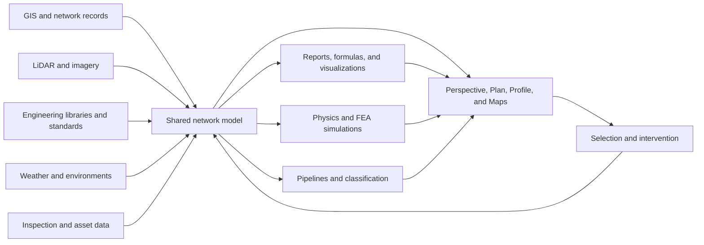
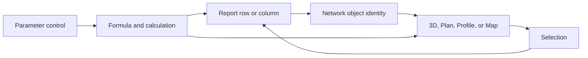

# Neara UI Research Report

| Field | Value |
| --- | --- |
| Product researched | Neara, the utility-network digital-twin platform |
| Research date | 2026-08-11 |
| Focus | Application UI, interaction model, workflows, visual language, and implications for GeoLibre Digital Twin |
| Evidence | Neara's current demo library and knowledge base, a 7:39 product walkthrough inspected frame by frame, 2026 Ausgrid training material, Neara release notes, product pages, and independent coverage |
| Confidence | High for the documented application shell and engineering workflows; medium for customer-specific risk/value modules; low for unexposed implementation technology and accessibility behavior |

## Executive summary

Neara is best understood as a **desktop engineering environment whose primary document is a living 3D network model**. It is not primarily a dashboard, a GIS viewer, or a collection of separate analysis applications. The same model is reused for network design, structural analysis, vegetation clearance, point-cloud classification, weather simulation, flood response, cascading-failure analysis, reports, and capital-planning scenarios. The strongest idea in the product is not the 3D rendering itself; it is that selection, asset identity, model properties, computed results, and spatial visualization remain connected across those tasks.

The application uses a dense, IDE/CAD-like shell:

- a global menu across the top;
- a vertical, customizable tool rail on the left;
- dockable and resizable panels containing tabs;
- a persistent, context-sensitive Properties panel, normally on the right;
- named workspace switchers along the bottom; and
- a large central Perspective, Plan, Profile, Analytics Map, or Map view.

The UI has two complementary modes of use. In **direct-manipulation mode**, an engineer selects or draws assets in the world and edits them through the Properties panel. In **analysis mode**, reports, formulas, sliders, simulations, and pipelines calculate values that feed back into the world as colors, labels, shapes, clearance markers, failure arcs, flood surfaces, and other overlays. These are not separate products: report rows can focus assets in 3D, report columns can control spatial visualizations, and parameter sliders can recompute report values and spatial overlays in real time.

Neara's current visual style is dark, restrained, and utilitarian. Most product chrome is low-contrast gray so the network, LiDAR, satellite imagery, and risk colors dominate. Its public demos often remove or minimize chrome to foreground the modeled world. This produces a strong sense that the twin is the interface, but it also creates risks: the screen can become visually noisy, color carries substantial meaning, controls can be small, and the expert shell exposes a steep learning curve.

For GeoLibre, the most valuable lessons are structural rather than cosmetic:

1. Preserve one world, one selection, and one asset identity across 2D, 3D, lists, reports, scenarios, and evidence.
2. Treat analytical results as lenses over the world, not as detached dashboards.
3. Use task-specific workspaces or product modes to control complexity.
4. Keep scenario parameters close to the world and update consequences visibly.
5. Make tables bidirectional: rows should navigate to assets, while visible columns can explain or control map/scene encodings.
6. Do not copy Neara's assumption that every user is an expert designer. GeoLibre's operational pilot needs a calmer, evidence-first shell with explicit provenance, uncertainty, and human-decision boundaries.

## 1. Scope and method

The prompt used the spelling “Neeras.” I treated that as **Neara** because Neara is a utility digital-twin product and is directly relevant to this repository's grid and wildfire product. No other plausible product found in the initial search matched the domain or the request for a detailed UI investigation.

The research used five evidence lanes:

1. **Current product demonstrations.** I inspected Neara's [demo library](https://neara.com/how-it-works) and the current [platform walkthrough](https://neara.com/resources/demo-videos/neara-platform-how-it-works/) frame by frame. The walkthrough shows the application moving between network-scale 3D visualization, vegetation and loading analysis, environmental controls, flood views, risk maps, asset inspection, and investment analysis.
2. **Product documentation.** Neara's [Knowledge Base](https://knowledge.neara.com/en/) documents the project shell, workspaces, selection model, keyboard shortcuts, layers, reports, formulas, pipelines, versions, sharing, and collaboration.
3. **Customer training.** Ausgrid's [Neara Digital Twin ASP3 portal](https://www.ausgrid.com.au/asp-and-contractors/network-design/neara-asp3-portal) publishes 2026 training videos and quick-reference guides. I visually inspected the guides for default workspaces, 3D navigation, keyboard shortcuts, component libraries, and conductor stringing.
4. **Product evolution.** Neara's [release notes](https://knowledge.neara.com/en/collections/9692070-release-notes) reveal recent UI and rendering changes, including a refreshed UI in June 2025, a new rendering engine in October 2025, consolidated report legends, sharper high-resolution graphics, and a library-filter redesign in March 2026.
5. **External validation.** Independent coverage from [TIME](https://time.com/6979530/neara/) and public customer material were used to validate that the modeled workflows are deployed for real utility use, not only marketing prototypes.

The report distinguishes documented facts from interpretation. Neara is a private, authenticated product, so implementation details such as its frontend framework, rendering libraries, internal API topology, telemetry, and accessibility audit results cannot be established from public evidence.

## 2. The product model behind the interface

Neara's UI makes more sense when viewed as a projection of its product model:



The shared model includes structures, poles, conductors, spans, assemblies, components, stays/guys, terrain, point clouds, imagery, environments, datasets, and user-defined fields. Neara's documentation describes datasets as global objects that can exist outside an individual project and be referenced by multiple projects. Dataset types include the network model, point clouds, geodata, server-side analytics reports, and imagery. See [About Datasets in Neara](https://knowledge.neara.com/en/articles/13221284-about-datasets-in-neara).

This produces four important UI properties:

- **Spatial continuity:** analysis remains attached to real assets and places.
- **Object continuity:** selecting a structure, span, or component exposes the same underlying identity in properties, reports, comments, and deep links.
- **Calculation continuity:** changing an input can update engineering calculations, tables, and spatial overlays together.
- **workflow continuity:** design, validation, reporting, and export operate inside a project instead of requiring repeated import/export between unrelated tools.

Neara's public positioning reinforces this model. It says the platform combines fragmented GIS, LiDAR, engineering, environmental, and inspection information into a geometrically precise model, then uses that model to evaluate severe weather, increased load, and design changes. The interface therefore expresses a **model-centric architecture**, not a page-centric one.

## 3. Information architecture

### 3.1 Home and project lifecycle

The Home screen is a launcher rather than an operational dashboard. It typically contains:

- **Start:** create a project from a network model, model file, organization template, or blank preset;
- **Recent:** recently created or accessed projects;
- **Sample Designs:** explorable examples; and
- **Tutorials:** onboarding videos.

Projects contain data, models, settings, workspaces, and versions. They autosave to the cloud every few minutes, while design-changing actions create versions. Users can add notes, inspect version history, load older versions, make a copy, or restore a version. See [The Home screen & your first project](https://knowledge.neara.com/en/articles/8942470-the-home-screen-your-first-project) and [Working with project Versions](https://knowledge.neara.com/en/articles/9082019-working-with-project-versions).

The organization project browser supports both table and map discovery. Projects can be made discoverable to allowed users, opened by name or ID, or located geographically. This is useful for utilities whose network is split into many geographically bounded projects. See [Browsing projects in your organization](https://knowledge.neara.com/en/articles/9082056-browsing-projects-in-your-organization).

### 3.2 The project shell

The current shell follows a stable anatomy:

```text
┌──────────────────────────────────────────────────────────────────────────────┐
│ Home  Project  Edit  Environments  Simulations  Clearances  View  Report… │
├──────┬───────────────────────────────────────────────┬───────────────────────┤
│ tool │ Perspective | Plan | Profile | Analytics Map │ Properties | Layers… │
│ rail │                                               │                       │
│      │             primary visual panel              │ context / tool state  │
│      │                                               │                       │
│      ├───────────────────────────────────────────────┤                       │
│      │ optional Profile, Report, or other panel      │                       │
├──────┴───────────────────────────────────────────────┴───────────────────────┤
│ Design | Map | Verification | Clearances | Exports | custom workspaces | + │
└──────────────────────────────────────────────────────────────────────────────┘
```

The exact top-level menu is organization and feature dependent. Public 2026 Ausgrid material shows items such as Home, Project, Edit, Environments, Simulations, Clearances, View, Report, Library, Admin, and Help. The top bar also includes global search, synchronization state, and the project name.

The left toolbar exposes active tools. It can be customized through an ellipsis at the bottom of the rail. The product offers keyboard shortcuts for frequent tools, including Move & Select (`M`), Pan (`A`), Conductor (`C`), Pole (`P`), Stay/Guy (`Y`), Split (`S`), Join (`J`), Obstruction (`O`), Survey/Terrain (`T`), Ground Clearance (`G`), Clearance (`D`), Profile Builder (`B`), and Datasets (`F`). `/` opens quick asset search and zoom. See [Keyboard shortcuts](https://knowledge.neara.com/en/articles/8942475-keyboard-shortcuts).

### 3.3 Workspaces, panels, and tabs

Inside a project, a **workspace** is a saved arrangement of panels and tabs for a task. A blank project usually includes Design and Map workspaces; customer templates can add workspaces such as Verification, Foundations, Clearances, Strength Supports, Strength Conductors, Failure Containment, Design Validation, Design Exports, and specialized visualization managers.

Panels are resizable and repositionable. Tabs can move within a panel, move between panels, or be snapped beside another panel to create a new split. A `+` control on a tab group opens a catalog of available views, tools, reports, and managers. Workspaces can be reset to their defaults, and users can create blank workspaces. Neara documents this behavior in [Using the project screen & workspaces](https://knowledge.neara.com/en/articles/8942478-using-the-project-screen-workspaces).

This is closer to an IDE or CAD product than a conventional web application. It accommodates very different tasks without creating a separate route and bespoke page layout for every function.

The cost is complexity. Users must understand the distinction between workspaces, panels, tabs, tools, views, and reports. The product mitigates this partly through organization templates and role configuration, but the learning burden remains visible in the amount of training material required.

## 4. The five principal views

Ausgrid's current training identifies five main visual views:

| View | Role | Important behavior |
| --- | --- | --- |
| Perspective | Primary 3D design and visualization surface | Shows terrain, structures, conductors, LiDAR, imagery, labels, analysis overlays, and simulation geometry |
| Plan | Top-down model view | Useful for line layout, easements, boundaries, and conductor blowout |
| Profile | Simplified side elevation of a selected corridor | Shows pole heights, conductor sag, terrain, and clearance relationships inside a configurable ribbon |
| Analytics Map | Searchable map with network/LiDAR coverage | Supports address search and `Jump to Location` into Perspective |
| Map | Simpler Google-style map | Good for location context, but does not provide the same jump-to-model behavior |

The [default workspace documentation](https://knowledge.neara.com/en/articles/8942478-using-the-project-screen-workspaces) says Perspective, Plan, Profile, and Analytics Map are integrated around the same location. Profile is derived from selected poles and conductors rather than acting as an unrelated chart.

Neara does not force all views to remain visible. They are tabs or panels that can be composed for the current job. This matters for performance as well as focus: Neara advises closing Profile in very large projects if responsiveness suffers. See [Improving display performance in large projects](https://knowledge.neara.com/en/articles/8942481-improving-display-performance-in-large-projects).

## 5. Selection and direct manipulation

### 5.1 Selection is the central interaction primitive

The Move & Select tool serves several roles:

- hover feedback;
- single selection;
- additive multi-selection with `Ctrl` or `Shift`;
- drag-box or polygon selection;
- moving selected objects; and
- clearing selection with right-click.

The Properties panel can limit selectable types to prevent accidental selection. Users can choose whether “structure” selection targets whole structures or individual components, and whether conductor selection targets a span or a longer strain section. This is crucial in a dense 3D model where many objects overlap. See [Move and select objects](https://knowledge.neara.com/en/articles/8942476-move-and-select-objects) and [Selecting and interacting with overhead line model objects](https://knowledge.neara.com/en/articles/9799143-selecting-and-interacting-with-overhead-line-model-objects).

### 5.2 The Properties panel is both inspector and editor

The right-hand Properties panel changes with the active tool or selected object. Depending on context it exposes:

- identity and labels;
- connected structures or conductors;
- library-backed type choices;
- voltage, cable arrangement, and material state;
- catenary definitions, temperatures, tension, and creep offset;
- assembly and component relationships;
- position offsets;
- selectable-type filters;
- calculation comparisons across environments;
- pass/fail tables; and
- export actions.

Linked property values can navigate from a component to its library definition, parent assembly, attached structure, or strain section. This turns the inspector into a graph-navigation surface.

### 5.3 Deep links preserve spatial context

Neara can generate a URL for a selected asset. Opening the link authenticates the user, loads the project, loads relevant data near the asset, zooms Perspective to it, and highlights it. Neara also documents link parameters for asset identity and latitude/longitude. See [Directly linking to an asset in a project](https://knowledge.neara.com/en/articles/9153287-directly-linking-to-an-asset-in-a-project).

This is a high-value collaboration pattern: a ticket, report, business dashboard, or comment can open the authoritative model at the relevant object instead of describing a location in prose.

## 6. Camera and navigation model

Neara is explicitly optimized for desktop mouse use. The 3D navigation model is:

- scroll to zoom toward or away from the cursor target;
- right-drag to orbit around the point under the cursor;
- middle-drag, `Alt`/`Option` + left-drag, or the Pan tool to move horizontally;
- `Shift` while panning to move vertically;
- right-button plus scroll to change Perspective field of view;
- the same gesture in Profile changes its horizontal/vertical scale ratio;
- `Z` frames the selected object(s);
- `1` creates a top-down, north-aligned view;
- `2` creates a transverse view for a selected pole;
- `3` and `4` create oblique north- and east-aligned views.

The camera orbits around a picked point rather than an abstract world origin. This is well suited to inspecting one pole, tree, or clearance conflict. The downside is discoverability: a user can unexpectedly zoom toward distant terrain if the cursor is not on the intended subject. Ausgrid's [3D control guide](https://www.ausgrid.com.au/asp-and-contractors/network-design/neara-asp3-portal) explicitly warns about this behavior.

Neara's public device guidance confirms the intended environment: at least a Core i7 or Apple M1, 16 GB RAM, SSD storage, and a modern integrated GPU, with 32 GB and a dedicated GPU recommended for large areas. Chrome is the principal supported browser; smartphones are unsupported and tablet access requires coordination. See [Recommended devices & supported browsers](https://knowledge.neara.com/en/articles/8942479-recommended-devices-supported-browsers).

## 7. Rendering, layers, and visual encodings

### 7.1 The scene is a composite, not a single rendering style

The Perspective view can combine:

- satellite or aerial imagery;
- terrain;
- LiDAR point clouds;
- modeled poles, conductors, assemblies, and other assets;
- vegetation clusters or individual-tree segmentation;
- flood or environmental surfaces;
- measurements and labels;
- calculated failure, fall-in, sag, sway, and clearance geometry; and
- report-driven colors, shapes, icons, and text.

Neara makes these layers legible through high-saturation analytical colors on top of a muted basemap. The platform walkthrough uses green for generally acceptable structures or outlines, red for overload/failure, blue/yellow/orange/red point clusters for graded vegetation or clearance results, and distinct colors for risk categories. These meanings are workflow dependent; they are not a single universal palette.

### 7.2 View controls expose quality/performance trade-offs

The View menu includes:

- asset coloring by conductor type, utilization, class, circuit, and other criteria;
- faster graphics, trading resolution for speed;
- eye-dome intensity for point-cloud contrast;
- cable-size multiplier;
- map-overlay opacity;
- terrain visibility;
- point-cloud visibility, point size, and coloring;
- clearance-violation highlighting;
- plan-view violation flags; and
- clearance markers grouped around selected conductors.

When utilization coloring is active, Neara calculates the worst-case pole loading as a percentage of allowable strength. Over-utilized poles can be labeled above 100% and highlighted with warning colors. See [View options](https://knowledge.neara.com/en/articles/8942560-view-options).

Point clouds can be colored by classification, map overlay, or capture time. Large datasets are not necessarily loaded automatically; the Datasets tool loads an area around a picked location, and users can reduce class density or hide classes. See [Point cloud display settings](https://knowledge.neara.com/en/articles/8942752-point-cloud-display-settings).

### 7.3 Recent rendering evolution

Neara's recent releases show sustained work on visual performance:

- the June 2025 [refreshed UI](https://knowledge.neara.com/en/articles/11520972-refreshed-ui) changed presentation while preserving feature locations and capability;
- the October 2025 [rendering-engine upgrade](https://knowledge.neara.com/en/articles/12989773-a-faster-smoother-neara-is-here) targeted loading, pan, and zoom;
- the October 2025 [legend update](https://knowledge.neara.com/en/articles/12989822-new-report-color-visualizations-in-the-perspective-view-legend) consolidated colors from multiple reports and asset-coloring modes;
- the December 2025 [high-resolution update](https://knowledge.neara.com/en/articles/12989882-new-sharper-graphics-for-modern-displays) improved labels, measurements, materials, and map overlays while preserving a faster-graphics fallback; and
- point-cloud improvements moved less-used controls into collapsible groups to reduce clutter.

This suggests that Neara's core UX challenges are not only computation. Visual density, display resolution, loading strategy, and interpretability are ongoing product concerns.

## 8. Reports are programmable, spatial analysis surfaces

Reports are one of Neara's most important and unusual UI systems.

### 8.1 Table behavior

Report tables are configurable, sortable, filterable, rearrangeable, and renameable. Cells can contain:

- text and numbers;
- formulas;
- hyperlinks;
- checkboxes and other controls;
- color pickers;
- icons; and
- progress bars.

Columns can pull fields from related objects, create user-defined fields, apply formulas, bulk-edit values, and filter with logical conditions. Exports include CSV, Excel, GeoJSON, Shapefile, KML, and DXF. See [Working with tables in Reports](https://knowledge.neara.com/en/articles/8942772-working-with-tables-in-reports).

### 8.2 Tables and the world are bidirectional

A report can color conductors, label spans, draw shapes, or place icons in Perspective, Profile, Plan, and Analytics Map. Filtering a table can reduce what is emphasized in the world. Clicking a report row can zoom to the associated asset. An eye icon in a column header can show or hide that column's visualization.

This is the architectural pattern to notice:



Neara's [Reports introduction](https://knowledge.neara.com/en/articles/8942769-an-introduction-to-neara-reports) explicitly describes a workflow where a user filters to high-risk spans, clicks a row, and zooms directly to the span in Perspective.

### 8.3 Parameters create live what-if tools

Users can place sliders, boolean switches, and text controls into a workspace. Parameter values can feed user-defined model fields and formulas. Adjusting a slider—for example, conductor temperature, wind pressure, or a clearance multiplier—updates report cells and model visualizations in real time. See [Interactive Parameter controls in Reports](https://knowledge.neara.com/en/articles/8942768-interactive-parameter-controls-in-reports).

This makes a “dashboard” in Neara less like a read-only BI page and more like a domain-specific application assembled from model fields, formulas, tables, controls, and spatial renderers.

## 9. Domain workflows

### 9.1 Network design and conductor stringing

The design workflow shows how tools, world interaction, libraries, properties, reports, workspaces, and export connect:

1. Activate the Conductor tool in the toolbar.
2. Choose a conductor type through the Properties panel, which opens the conductor library.
3. Search the library and select the desired conductor.
4. Click locations for new poles; Neara places the structures and strings the conductor.
5. Exit the drawing mode, select the new span, and set voltage, catenary definition, reference temperature, tension, and creep offset in Properties.
6. Switch to a Verification workspace.
7. Filter the strain-section report to objects attached to the current selection.
8. Set material status, inspect the suggested creep offset, and iterate values until the organization-defined rules settle.
9. Review tension across environments and pass/fail limits.
10. Export initial or final stringing tables for construction use.

The interaction is powerful but expert-oriented. It assumes users understand domain vocabulary, workspaces, selection scope, tension definitions, environment rules, and the distinction between initial and final conductor state. Organization-specific libraries and validation tables are essential guardrails.

### 9.2 Vegetation and clearance analysis

In the current platform demo, Neara segments canopy data into individual trees, calculates fall directions and overfall distances, and overlays arcs showing which falls could contact and pull down the line. Environmental controls can adjust temperature, wind pressure, wind direction, and ice load. Visual toggles show maximum sag, median storm, or maximum storm cable positions.

The UI combines:

- the 3D world;
- selected/all-assets scope controls;
- tabbed vegetation-encroachment and environment-simulation modes;
- sliders with numeric values;
- visualization toggles; and
- asset-level utilization labels.

The key UX move is **showing the physical consequence in place**. The user does not have to translate a table cell that says “clearance = 2.1 m under environment X” into a mental picture; the hazardous vegetation and possible conductor positions are drawn around the actual span.

### 9.3 Pole loading, FEA, and cascading failure

The FEA panel is added like other panels. Users select model objects in Perspective, configure environments, wind directions, load source, and structure-model settings, and run one or all simulations. Perspective can show the deformed or failing structure, while report sections expose detailed results. See [How to use FEA panel](https://knowledge.neara.com/en/articles/10479707-how-to-use-fea-panel).

The product demo goes further by simulating cascading failure across connected poles. A user can fail an initial structure, see how far the failure propagates, add an intervention such as a guy wire, and rerun. The visual result updates so the user can see that downstream failure is contained. This is a good example of an intervention loop:

```text
identify vulnerable structure → simulate failure → inspect propagation
→ add intervention → recompute → compare changed consequence
```

### 9.4 Flood response

Flood is shown as an environmental surface rising around network assets. Labels and line colors remain attached to the network while the scene communicates access, inundation, and clearance context. Neara positions this for pre-event planning, in-event switching/restoration decisions, and post-event inspection prioritization. See [Where will flood waters impact your assets?](https://neara.com/resources/demo-videos/where-will-flood-waters-impact-your-assets).

The UI benefit is contextual fusion: terrain, roads, water, spans, and asset state can be considered together rather than in separate maps and spreadsheets.

### 9.5 Risk and Value Optimization

The RVO demo uses a different scale and composition from detailed engineering work. At network scale, a satellite map is covered with colored, variably sized risk bubbles. A right-side Parameters panel contains expenditure sliders for wildfire, reliability, safety, and environmental programs. It displays estimated investment, estimated risk cost saved, and horizontal bars for forecast risk. Bottom workspace tabs include views such as Network overview, Depot overview, and Investments.

Dragging a budget slider changes totals, risk bars, and map symbols. At asset scale, selecting a span opens a right-side inspection panel with:

- asset details;
- connected poles and voltage;
- CTS/vegetation-point statistics;
- benefit-cost ratio and net present value;
- bushfire benefit;
- feeder and restoration inputs; and
- selected-span count, length, replacement cost, total benefit, BCR, and NPV.

The panel also exposes toggles for span labels, vegetation points, and point clouds, plus depot selection and export actions. Neara describes the broader capability as asset-level risk modeling, intervention comparison, and regulator-ready evidence. See [Risk & Value Optimization](https://neara.com/solutions/risk-value-optimization) and [Risk Impact Scoring](https://neara.com/capabilities/risk-impact-scoring).

This workflow shows Neara can present both engineering detail and executive planning in the same platform, but it also reveals the importance of task-specific workspaces. The RVO user does not need the full conductor-design toolset visible.

### 9.6 LiDAR classification pipelines

Pipelines automate large-scale processing. The auto-classifier pipeline has five visible stages: Input, Pre-processing, Classification, Post-processing, and Output. Users choose a dataset, configure presets or advanced steps, define an output, and select a limited area in Perspective for preview.

Preview results appear directly in the world. Eye controls on stages and steps let users compare intermediate effects. The full process exposes confirmation, stop, queued/preparing/processing/completed progress states, and the resulting point cloud appears in Layers. See [Automatically classify LiDAR](https://knowledge.neara.com/en/articles/8942748-automatically-classify-lidar).

This is a strong pattern for expensive computation: preview on a bounded spatial sample, expose intermediate stages, then run the full dataset with explicit progress.

## 10. Collaboration, sharing, and auditability

Neara projects live in the cloud. Owners can share with individual users or teams at Read, Write, or None access levels. Discoverability controls whether allowed projects appear in organization map/table browsing. External sharing creates a snapshot rather than granting uncontrolled access to the live project. See [Share a project in your organization](https://knowledge.neara.com/en/articles/9082189-share-a-project-in-your-organization) and [Share a project outside your organization](https://knowledge.neara.com/en/articles/9086438-share-a-project-outside-your-organization).

Project comments are spatially anchored to assets. Comment mode displays a right-side Comments panel and markers on structures. Users can create threads, reply, `@` mention colleagues, receive email notifications, resolve threads, deep-link to a comment, and export comments to CSV. Resolved threads are hidden by default and cannot be reopened. See [Commenting in projects](https://knowledge.neara.com/en/articles/8942802-commenting-in-projects).

Versioning is design-oriented rather than Git-like. Autosaves create versions when the design changes; notes help communicate why a version exists; prior versions can be inspected, copied, or restored. Shared-project ownership and reload behavior provide a basic concurrency model, but public documentation does not establish real-time co-editing or conflict resolution.

## 11. Visual and interaction design assessment

### 11.1 What the UI does well

**The world owns the screen.** Neara dedicates most space to the spatial model. Panels support interpretation and action rather than reducing the world to a small dashboard tile.

**The product uses a stable shell.** New capabilities usually appear as a tool, panel, tab, report, visualization, or workspace. This reduces navigational fragmentation.

**Selection is consistent.** Search, report rows, direct world clicks, comments, and deep links converge on asset identity and spatial focus.

**Properties stay contextual.** The right-side inspector avoids a modal dialog for every edit and makes related model entities traversable.

**Analysis is visible in place.** Sag, sway, fall-in arcs, flood levels, point-cloud violations, pole loading, and interventions are spatial consequences, not merely numbers.

**What-if controls are immediate.** Sliders and toggles support hypothesis testing without leaving the scene.

**The system supports progressive task composition.** Expert teams can build specialized workspaces and reports on top of the same model.

**Preview precedes expensive processing.** LiDAR pipelines let users test a small area and inspect stages before full execution.

### 11.2 Friction and risks

**High expert burden.** The UI is dense and domain-specific. Menus, tool icons, workspaces, panels, tabs, properties, libraries, and reports create a large interaction vocabulary.

**Small controls and low contrast.** Public captures show compact text, small icons, and subtle panel dividers. This suits high-information-density workstations but may be difficult at high browser zoom or for low-vision users.

**Color overload.** Multiple simultaneous reports, asset-color modes, LiDAR classifications, and risk overlays can compete. Neara's 2025 consolidated legend update implicitly acknowledges this problem.

**Hidden state.** A calculation can depend on the current environment, selected asset scope, workspace, visible report columns, active filters, loaded dataset area, and user-defined model fields. The model is powerful, but users can lose track of why the scene looks a certain way.

**Interaction conflicts.** Right-click clears selection, orbits in Perspective, and opens context behavior in Analytics Map depending on state. Middle-button and modifier gestures have a learning curve, especially on trackpads.

**Performance is part of usability.** Users may need to load data by area, reduce point density, enable faster graphics, split projects, or close views. Neara exposes these controls, but they place optimization responsibility on the user.

**Marketing captures understate operational chrome.** Neara's public demos often crop or minimize the shell. The production training material is significantly denser than the cinematic product story.

**Public evidence on accessibility is thin.** The docs do not establish WCAG conformance, keyboard-only completeness, screen-reader semantics for the 3D scene, reduced-motion behavior, or non-color equivalents for every visualization.

## 12. What is fact, inference, and unknown

### Sourced facts

- Neara is a browser-based, cloud project environment with organization accounts, roles, teams, sharing, and versions.
- The project shell uses menus, a customizable toolbar, dockable panels/tabs, Properties, and named workspaces.
- Perspective, Plan, Profile, Analytics Map, and Map are principal views.
- Reports can calculate model data, control spatial visualizations, respond to parameters, and deep-link or zoom to objects.
- The product supports LiDAR, imagery, network models, geodata, environments, FEA, clearances, design tools, and exports.
- The official device guidance is desktop-first and explicitly excludes smartphones.
- The current demo shows vegetation, loading, flood, cascading failure, design, RVO, and benefit-cost workflows in the shared spatial model.

### Reasonable inferences

- Neara's UI architecture is likely panel/plugin oriented internally because major capabilities consistently appear through tools, panels, reports, and workspaces. The public sources do not reveal the implementation framework.
- Organization templates are probably the main mechanism for turning a general expert platform into customer-specific products. Ausgrid's many preconfigured workspaces, reports, libraries, and rules support this inference.
- The formula/report layer functions as a low-code product surface. It can create new fields, calculations, controls, and spatial visualizations without requiring a new first-class screen for every analysis.
- Neara prioritizes expert flexibility over novice simplicity. The breadth of shortcuts and training material supports this, but no public usability study was found.

### Unknowns

- exact frontend framework, WebGL engine, state model, or API architecture;
- initial load times and frame rates at representative network scales;
- keyboard-only and assistive-technology coverage;
- mobile or field-worker product strategy beyond “contact Neara” for tablets;
- whether concurrent editing has locking, merging, or conflict resolution;
- how permissions apply to individual datasets, reports, formulas, and exports in every module;
- how customer-specific RVO calculations expose provenance and uncertainty;
- how much of the cinematic demo is standard product versus configured customer workspaces; and
- licensing, pricing, and feature packaging for specific UI modules.

## 13. Implications for GeoLibre Digital Twin

GeoLibre's current product requirements already agree with Neara's strongest principle: **the world is the decision surface, not a decorative map**. Neara provides concrete evidence for several architecture and UX decisions, while also showing where GeoLibre's operator product should diverge.

### 13.1 Copy the structural ideas

| Neara pattern | GeoLibre adaptation |
| --- | --- |
| One shared model across views and analyses | Preserve region, stable object selection, time, scenario, and camera target across plan, 3D, lists, evidence, and replay |
| Report rows and 3D objects are bidirectionally linked | Make alerts, runs, evidence rows, and search results focus the same world object; selection should update all supporting panels |
| Parameter changes update the spatial consequence | Keep bounded scenario controls beside the world and show local preview versus Engine-validated truth explicitly |
| Workspaces compose tools for different jobs | Use Digital Twin versus Expert GIS as the primary complexity boundary; add task-specific panel arrangements inside those modes only when validated |
| Deep links restore an asset in context | Restore authorized region, object, alert/run, time tick, plan/3D mode, and evidence section after access checks |
| Expensive pipelines support bounded previews | Preview spatial scope before full wildfire/physics runs and expose durable queued/running/completed/failed states |
| Legend consolidates active analytical encodings | Generate one visible legend from current evidence layers, and identify source, freshness, and authority as well as color meaning |
| Libraries and templates encode standards | Keep utility policies, model versions, and approved thresholds Engine-owned and versioned; expose their identity in evidence, not as unexplained UI defaults |

### 13.2 Adapt, do not copy

**Do not expose the expert shell to operators.** Neara's shell is appropriate for engineers building and validating network designs. GeoLibre's pilot operators need the focused Digital Twin header, Operations panel, world canvas, Evidence inspector, and replay dock already defined in the [Digital Twin UI specification](../digital-twin-ui-spec.md).

**Do not let presentation edits masquerade as authoritative model edits.** Neara supports moving poles and editing model objects directly. GeoLibre's operational product must keep local scenario intent visibly separate from published network truth and require Engine validation before anything becomes evidence.

**Do not make color the evidence.** Neara's high-saturation overlays are effective, but GeoLibre should pair them with names, values, units, uncertainty, freshness, and explicit states. The Evidence inspector should explain why an object is colored, not merely repeat the color category.

**Do not require users to manage rendering performance manually for the core workflow.** Expert controls for point density and quality can remain in Expert GIS. The operational shell should apply safe budgets and degradation automatically, then explain when fidelity is reduced.

**Do not reproduce unlimited workspace configurability in the pilot.** Neara demonstrates the power and cost of IDE-style composition. GeoLibre should first ship stable, tested workflow layouts; user-defined workspaces can come later if real operator needs justify them.

### 13.3 Product opportunities Neara makes visible

1. **A linked evidence table.** Add an expert/supervisor table where visible evidence columns can label or color assets, and row selection frames the corresponding object. Keep formulas and scoring Engine-owned for the operational product.
2. **A profile lens.** Neara's side-on Profile view is extremely effective for conductors, terrain, and clearance. GeoLibre's pilot can initially use a focused clearance profile rather than a fully customizable panel system.
3. **Intervention comparison in place.** The cascading-failure demo shows the value of visual before/after intervention. GeoLibre should keep one canvas and clearly toggle Baseline, Local Preview, and Validated Result rather than opening detached comparison pages.
4. **Spatial comments and handoffs.** Neara's asset-anchored comments are useful, but GeoLibre should attach discussion to durable alert/run/handoff evidence, including immutable time and model identities.
5. **Progressive network scale.** Neara moves from a risk bubble at network scale to precise span and component detail. GeoLibre needs semantic level-of-detail so the meaning of marks changes deliberately with scale rather than merely rendering more geometry.
6. **Visible active-analysis stack.** Because Neara can accumulate hidden filters and visualizations, GeoLibre should show a compact, inspectable list of active evidence lenses with source, time, and clear reset behavior.

## 14. Recommended follow-up validation

If a Neara account or live sales demo becomes available, the next research pass should test these questions directly:

1. How long does it take a new engineer to understand workspaces, panels, tabs, tools, and selection scope?
2. Does selection remain stable when switching Perspective, Plan, Profile, and report tabs?
3. How are conflicting visualizations ordered, blended, and explained?
4. What happens when a report formula, simulation, or pipeline fails?
5. How does the UI distinguish stale, approximate, customer-supplied, and physics-verified values?
6. What is preserved in a project deep link: camera, workspace, visible layers, selection, filters, environment, and version?
7. How does concurrent editing behave when two users take write ownership?
8. Can all primary workflows be completed at 200% browser zoom and without a mouse?
9. What are representative load, pan, and simulation latencies for feeder, region, and network scale?
10. Which RVO panels are standard product and which are custom reports/workspaces?

## 15. Source index

### Primary product and UI sources

- [Neara demo library](https://neara.com/how-it-works)
- [Neara Platform—How It Works](https://neara.com/resources/demo-videos/neara-platform-how-it-works/)
- [Neara Knowledge Base](https://knowledge.neara.com/en/)
- [Projects and workspaces](https://knowledge.neara.com/en/collections/8341422-projects-and-workspaces)
- [Using the project screen & workspaces](https://knowledge.neara.com/en/articles/8942478-using-the-project-screen-workspaces)
- [Keyboard shortcuts](https://knowledge.neara.com/en/articles/8942475-keyboard-shortcuts)
- [View options](https://knowledge.neara.com/en/articles/8942560-view-options)
- [Move and select objects](https://knowledge.neara.com/en/articles/8942476-move-and-select-objects)
- [Directly linking to an asset](https://knowledge.neara.com/en/articles/9153287-directly-linking-to-an-asset-in-a-project)
- [Reports & visualization](https://knowledge.neara.com/en/collections/8356321-reports-visualization)
- [Interactive Parameter controls in Reports](https://knowledge.neara.com/en/articles/8942768-interactive-parameter-controls-in-reports)
- [Automatic LiDAR classification](https://knowledge.neara.com/en/collections/8356290-automatic-lidar-classification)
- [Commenting in projects](https://knowledge.neara.com/en/articles/8942802-commenting-in-projects)
- [Release notes](https://knowledge.neara.com/en/collections/9692070-release-notes)
- [Ausgrid Neara Digital Twin ASP3 portal](https://www.ausgrid.com.au/asp-and-contractors/network-design/neara-asp3-portal)

### Capability and workflow sources

- [Risk & Value Optimization](https://neara.com/solutions/risk-value-optimization)
- [Risk Impact Scoring](https://neara.com/capabilities/risk-impact-scoring)
- [Vegetation Management](https://neara.com/capabilities/vegetation-management/)
- [Wildfire Management](https://neara.com/capabilities/wildfire-management)
- [Design & Construction](https://neara.com/solutions/design-construction/)
- [Which poles could trigger a cascading failure?](https://neara.com/resources/demo-videos/which-poles-could-trigger-a-cascading-failure)
- [Where will flood waters impact your assets?](https://neara.com/resources/demo-videos/where-will-flood-waters-impact-your-assets)
- [How can you speed up design work?](https://neara.com/resources/demo-videos/how-can-you-speed-up-design-work)

### External validation

- [TIME: Neara](https://time.com/6979530/neara/)

## Bottom line

Neara's UI works because it makes the network model the common language between engineering data, physics, visual analysis, and action. Its competitive advantage is not a single attractive 3D viewer. It is the ability to move continuously from “show me the network” to “show me this asset,” “show me why it fails,” “change this assumption,” “show me the consequences,” and “export or share the evidence” without losing spatial or object context.

For GeoLibre, the opportunity is to retain that continuity while producing a more explicit operational contract: fewer expert controls by default, stronger evidence and uncertainty treatment, visible separation of local scenarios from authoritative results, and calmer workflows for users who must make time-sensitive human decisions rather than design the network itself.
