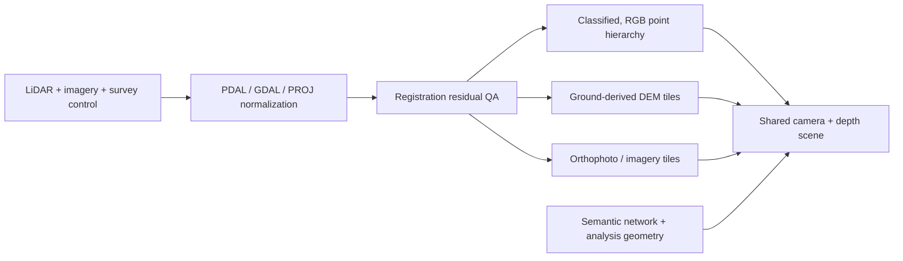

# Seamless point-cloud and imagery fusion

**Research date:** 2026-08-07  
**Status:** Implementation-spike recommendation; not an ADR  
**Scope:** Browser rendering of LiDAR/point clouds over satellite or orthophoto
terrain, with Neara's public product behavior as the reference.

## Executive answer

Neara's effect is not best understood as one fused dataset. It is a coordinated
render stack:

1. imagery is georeferenced and draped over a terrain mesh;
2. LiDAR is transformed into the same horizontal **and vertical** reference;
3. ground-class LiDAR points are hidden so the clean imagery remains the ground;
4. above-ground points are colored from the map imagery, while engineering
   classes keep strong semantic colors;
5. adaptive point sizing and eye-dome lighting make sparse points read as solid
   vegetation and structures;
6. terrain, point tiles, and engineering geometry share one camera and depth
   buffer; and
7. independent imagery, terrain, and point-cloud LOD pyramids stream a coarse
   result first and refine with camera distance.

Neara documents nearly this exact composition. Its **Map overlay** point-color
mode colors points from the underlying map “to create a more realistic view of
vegetation and structures”; the same guidance recommends turning off ground
points to reveal the overlay. It also exposes point size, per-class density, and
eye-dome intensity, while allowing conductors and structures to retain standard
class colors. [Neara point-cloud display settings](https://knowledge.neara.com/en/articles/8942752-point-cloud-display-settings)
and [Neara view options](https://knowledge.neara.com/en/articles/8942560-view-options)

The attached reference image is consistent with that documented technique:
satellite imagery supplies the continuous ground and roof texture; circular,
map-colored point splats supply three-dimensional vegetation and structures;
bright classified points and fitted network geometry remain legible on top.

For GeoLibre, the smallest credible spike is:

- preprocess one corridor with PDAL/GDAL/PROJ into a common 3D reference;
- derive the terrain from the same ground-class LiDAR where possible;
- tile the orthophoto/imagery and point cloud independently;
- bake imagery-derived RGB onto non-ground points;
- render opaque imagery on DEM terrain and a ground-filtered 3D Tiles point
  cloud in the same depth buffer; and
- compare the existing Cesium path (built-in point attenuation and eye-dome
  lighting) with the existing MapLibre/deck.gl path (best product integration,
  but eye-dome lighting would require a custom rendering effect).

Do not start with Gaussian splatting, NeRF, or photogrammetric meshing. None is
needed to reproduce the reference effect, and Neara does not publicly claim to
use them.

## What Neara publicly establishes

### Evidence

- A terrain overlay is placed on a 3D terrain model and aligned to its
  topography. Neara supports Google Satellite/Maps, OpenStreetMap, ESRI World
  Imagery, and user georeferenced imagery, with an EPSG confirmation during
  import. [Neara terrain-overlay import tutorial](https://knowledge.neara.com/en/articles/9913980-tutorial-import-imagery-for-terrain-overlays-using-the-importer-tool)
- LiDAR import reads embedded spatial-reference information or lets the user
  choose/override an EPSG code. Neara warns that mixing source EPSGs can produce
  unpredictable results. [Neara LiDAR import](https://knowledge.neara.com/en/articles/8942749-import-and-preview-lidar-data)
- A dataset may have a custom EPSG and positional offset, providing an explicit
  correction path after initial georeferencing. [Neara dataset removal and settings](https://knowledge.neara.com/en/articles/13221371-remove-datasets-from-a-project)
- Neara preprocesses and classifies point clouds rather than rendering raw
  scans unchanged. Its published pipeline includes preprocessing,
  classification, and postprocessing such as normalization, denoising, and
  filtering. [Neara automatic LiDAR classification](https://knowledge.neara.com/en/articles/8942748-automatically-classify-lidar)
  and [point-cloud classes](https://knowledge.neara.com/en/articles/12468177-point-cloud-classes)
- Point clouds, imagery, and the engineering-grade Network Model are distinct
  dataset types. The Network Model is derived from LiDAR, GIS, manual designs,
  and other inputs rather than being the rendered point cloud itself.
  [Neara dataset model](https://knowledge.neara.com/en/articles/13221284-about-datasets-in-neara)
  and [LiDAR datasets](https://knowledge.neara.com/en/articles/8997901-lidar-point-clouds-and-datasets-in-neara)
- Neara says its ingestion pipeline normalizes, stitches, and quality-checks
  LiDAR, imagery, GIS, and asset records. Its reconciliation capability also
  describes a topological fit using proximity and logical asset characteristics,
  with GIS checked against LiDAR and satellite imagery. These are product-level
  descriptions, not disclosed algorithms. [Neara platform](https://neara.com/our-platform)
  and [LiDAR/GIS reconciliation](https://neara.com/capabilities/lidar-gis-reconciliation)

### Inference, not disclosed Neara implementation

The public evidence supports common georeferencing, imagery-on-terrain,
map-color projection onto points, class filtering, semantic coloring, and
eye-dome contrast. It does **not** reveal Neara's tile format, point primitive,
shader, depth strategy, color-sampling resolution, registration optimizer, or
GPU architecture. The circular appearance is compatible with conventional
point sprites or rounded splats. There is no public basis to call it 3D Gaussian
splatting, a NeRF, learned sensor fusion, or texture-baked photogrammetry.

No publicly indexed patent family was found under the Neara or Linesoft entity
names during this review. That is not evidence that no filing exists under
another name or is unpublished.

## The methods that produce the seamless appearance

### 1. Solve registration before rendering

Horizontal CRS agreement is necessary but insufficient. The ingest record must
retain:

- source horizontal CRS and axis order;
- source vertical CRS/datum and units;
- coordinate epoch where the reference frame is dynamic;
- acquisition time and stated accuracy for LiDAR, imagery, and DEM;
- the exact coordinate operation and grid files used; and
- any final calibrated rigid offset/rotation, as explicit provenance rather
  than a hidden viewer tweak.

PDAL's reprojection filter uses PROJ and supports horizontal and vertical datum
transformations. [PDAL reprojection](https://pdal.io/en/stable/workshop/introduction/reprojection.html)
PROJ represents transformations as operation pipelines and uses horizontal and
vertical shift grids where required. [PROJ geodetic transformations](https://proj.org/en/stable/usage/transformation.html)
GDAL can warp imagery between CRSs and can apply vertical transformations when
a 3D or compound CRS is present; it also supports explicit source/target
coordinate epochs. [GDAL `gdalwarp`](https://gdal.org/en/stable/programs/gdalwarp.html)
and [GDAL coordinate epochs](https://gdal.org/en/stable/user/coordinate_epoch.html)

The common web target can be Earth-centered coordinates/ellipsoidal height for
globe rendering, or a stable local projected frame plus a WGS84 anchor for a
regional MapLibre/deck.gl scene. 3D Tiles geographic `region` bounding volumes
use EPSG:4979 longitude, latitude, and ellipsoidal height; tile transforms can
place locally encoded content without sacrificing point precision.
[OGC 3D Tiles 1.1 specification](https://docs.ogc.org/cs/22-025r4/22-025r4.pdf)
deck.gl likewise documents meter offsets around a longitude/latitude/altitude
origin, which is preferable to passing large global coordinates through
single-precision GPU attributes. [deck.gl coordinate systems](https://deck.gl/docs/developer-guide/coordinate-systems)

The most visible failure is usually a vertical-datum mismatch: orthometric
LiDAR or DEM heights are treated as ellipsoidal heights, shifting the cloud by
the local geoid separation. The existing Golden pilot already handles this
case; see [`docs/usgs-lidar-3d-tiles.md`](../usgs-lidar-3d-tiles.md).

After transformation, validate with surveyed checkpoints and stable tie objects
such as pole bases, roof corners, and road markings. Report horizontal residuals
and terrain-to-ground-point vertical residuals (median and tail), then store any
approved correction with the dataset. A visual “looks aligned” check is useful
but not an accuracy specification.

### 2. Make imagery the continuous ground surface

Satellite or orthophoto pixels do not become three-dimensional by themselves.
They are sampled as a texture over a DEM/terrain mesh. MapLibre's official
hybrid example combines a raster satellite source with a `raster-dem` terrain
source; Cesium's globe similarly owns terrain geometry and imagery layers.
[MapLibre hybrid satellite terrain example](https://maplibre.org/maplibre-gl-js/docs/examples/display-a-hybrid-satellite-map-with-terrain-elevation/)
and [Cesium `Globe`](https://cesium.com/learn/cesiumjs/ref-doc/Globe.html)

For a survey corridor, generate the local high-resolution terrain from the
classified LiDAR ground surface where licensing and coverage permit. This
minimizes disagreement between the displayed ground and the point cloud. Blend
or feather that local terrain into the regional DEM outside the survey extent;
keep the orthophoto cutline/nodata mask aligned with the terrain extent. GDAL's
warper provides reprojection, resampling, cutlines, alpha/nodata handling, and
mosaicing; imagery resampling should be chosen deliberately rather than relying
on the nearest-neighbor default. [GDAL `gdalwarp`](https://gdal.org/en/stable/programs/gdalwarp.html)

Then suppress ground-class points in the beauty view. Rendering both a textured
terrain surface and dense ground returns creates moire, z-fighting, noisy color,
and needless overdraw. Keep ground points available for inspection and QA, but
not enabled by default. This is also Neara's published recommendation.

### 3. Color elevated points so they belong to the image

Use a deterministic color policy:

1. retain calibrated per-point RGB when the point cloud already has suitable
   color synchronized to acquisition;
2. otherwise sample a temporally appropriate orthophoto/map raster at each
   point's horizontal coordinate during preprocessing and store RGB in the
   point attributes;
3. preserve classification, intensity, return information, and original RGB so
   operators can switch styles; and
4. override map-derived color for selected engineering classes—conductors,
   poles, clearance violations, and analysis results—with semantic palettes.

Server-side/batch colorization is more reproducible and cheaper per frame than
sampling map tiles in the browser. It also avoids cross-origin and tile-cache
coupling. The result is visual, not geometric fusion: the LiDAR XYZ remains the
survey evidence while color comes from the image. A date mismatch can paint a
removed tree or changed roof onto current geometry, so acquisition dates and a
toggle back to intensity/classification remain essential.

Cesium ion preserves common LAS/LAZ per-point properties, including RGB,
intensity, return, classification, scan information, and GPS time, when tiling
point clouds to 3D Tiles. [Cesium point-cloud tiling](https://cesium.com/learn/3d-tiling/ion-tile-point-clouds/)

### 4. Render points as surfaces without pretending they are a mesh

One-pixel square points look sparse and disconnected. Use screen-aware point
attenuation tied to source spacing/geometric error, circular or rounded point
sprites, and a bounded pixel-size range. Eye-dome lighting (EDL) is a
screen-space depth-contrast technique that strengthens silhouettes and local
depth differences, making foliage and structures readable without normals or
surface reconstruction. It is not a physically based light model and does not
repair missing data.

Cesium's `PointCloudShading` directly supports geometric-error-based point
attenuation, maximum attenuation, base resolution, eye-dome lighting strength
and radius, normal shading, and optional back-face culling when normals exist.
[Cesium `PointCloudShading`](https://cesium.com/learn/cesiumjs/ref-doc/PointCloudShading.html)
Potree exposes the same family of practical controls—point budget, adaptive
size, point shape, RGB/classification styles, and EDL—and its research describes
browser rendering of very large multiresolution point clouds.
[Potree source and examples](https://github.com/potree/potree)
and [Potree thesis](https://www.cg.tuwien.ac.at/research/publications/2016/SCHUETZ-2016-POT/)

deck.gl's standard `PointCloudLayer` provides fixed point size, color, normals,
coordinate systems, picking, and material lighting, but no documented EDL
control. [deck.gl `PointCloudLayer`](https://deck.gl/docs/api-reference/layers/point-cloud-layer)
Therefore the MapLibre/deck path needs either a custom luma.gl/deck effect or a
specialist point-cloud sublayer to match Neara's documented eye-dome control.
It should not be assumed that simply increasing `pointSize` will look the same;
large flat disks cause overlap and depth artifacts.

### 5. Use one depth buffer and treat opacity carefully

Terrain must occlude points behind ridges and buildings/points must occlude the
ground. Two independently composited canvases cannot do this correctly. deck.gl
interleaved mode renders into MapLibre's WebGL2 context specifically so layers
can mix with map layers and 3D objects can occlude one another.
[deck.gl with MapLibre](https://deck.gl/docs/developer-guide/base-maps/using-with-maplibre)
MapLibre custom layers with `renderingMode: "3d"` share the map depth buffer.
[MapLibre custom-layer contract](https://maplibre.org/maplibre-gl-js/docs/API/interfaces/CustomLayerInterface/)

Keep the terrain imagery opaque in the primary view. MapLibre's implementation
writes raster depth when raster opacity is exactly `1`; translucent raster
layers use read-only depth and alpha compositing, which changes overlap
behavior. [MapLibre raster drawing source](https://github.com/maplibre/maplibre-gl-js/blob/main/src/webgl/draw/draw_raster.ts)

In Cesium, terrain and 3D Tiles already participate in the scene render. Enable
terrain depth testing when required, but account for the documented caveat that
terrain LOD changes and numerical noise can make surface-bound primitives
briefly disappear below terrain. [Cesium `Globe.depthTestAgainstTerrain`](https://cesium.com/learn/cesiumjs/ref-doc/Globe.html#depthTestAgainstTerrain)
Ground-point suppression, an evidence-based vertical correction, and narrowly
scoped depth bias for derived overlays are preferable to globally disabling
depth testing.

### 6. Tile every large source independently, then synchronize refinement

Do not ship a monolithic LAS/LAZ file to a generic point layer. Build a spatial
hierarchy with coarse representatives and progressively denser descendants.
3D Tiles defines hierarchical LOD, bounding volumes, geometric error in meters,
and screen-space-error-driven refinement. [OGC 3D Tiles 1.1](https://docs.ogc.org/cs/22-025r4/22-025r4.pdf)
CesiumJS exposes maximum screen-space error, progressive and foveated loading,
tile cache budgets, and distance-dependent detail controls.
[Cesium `Cesium3DTileset`](https://cesium.com/learn/cesiumjs/ref-doc/Cesium3DTileset.html)

COPC is a range-readable LAZ 1.4 organization with a clustered octree and
hierarchy pages, useful as a canonical or analysis format and for clients that
can request spatial nodes directly. [COPC 1.0 specification](https://copc.io/)
Potree's current converter research generates bottom-up LODs in an out-of-core
octree and evaluates random versus approximate blue-noise sampling; the latter
improves the visual distribution of coarse levels.
[Fast out-of-core octree generation](https://www.cg.tuwien.ac.at/research/publications/2020/SCHUETZ-2020-MPC/)

The perceived transition is best produced by:

- loading a spatially complete coarse level first;
- maintaining roughly stable projected point coverage as detail changes;
- using parent/child replace or well-controlled additive refinement rather than
  drawing two dense opaque levels on top of each other;
- prioritizing the center of view and the camera's likely destination;
- retaining recently used tiles within a measured GPU-memory budget; and
- matching the terrain and imagery request priorities to the point-cloud view.

Cross-fading LODs is optional, not foundational. Transparent point sprites
interact poorly with depth writes and EDL, and can make refinement look like a
brightness pulse. First achieve stable coarse-to-fine coverage with opaque
points; benchmark a short dithered or temporal transition only if replacement
popping remains visible.

## Satellite, orthophoto, and photogrammetry are different inputs

| Input | Geometry | Best use | Limitation in this effect |
| --- | --- | --- | --- |
| Satellite imagery | 2D raster draped over DEM | Regional context and areas outside the survey | Resolution, date, off-nadir displacement, and coarse DEM do not reproduce facades or canopy shape |
| Orthophoto | Orthorectified 2D raster draped over DEM | High-resolution corridor color and ground appearance | Still supplies no independent side/facade geometry; temporal mismatch remains possible |
| LiDAR with map-derived RGB | Measured 3D points, raster-derived color | The Neara-like “painted” foliage/building effect while preserving survey XYZ | Gaps remain gaps; color projection can paint occluded or changed surfaces incorrectly |
| Photogrammetry reality mesh | Textured reconstructed 3D surface | Photorealistic buildings/facades where image coverage is sufficient | Larger preprocessing and streaming cost; geometry may conflict with LiDAR and terrain unless clipped and registered |

A local photogrammetry mesh can replace terrain/point rendering inside a
well-defined footprint, with clipping and a feathered boundary, but it should
not be added merely to make colored LiDAR look continuous. Cesium treats
imagery, terrain, point clouds, and photogrammetry as distinct tiling inputs,
which reinforces this separation. [Cesium 3D tiling pipeline](https://cesium.com/learn/3d-tiling/)

## Recommended GeoLibre architecture

This recommendation fits the renderer layering already selected in
[`docs/research/main-map-3d-rendering-architecture.md`](main-map-3d-rendering-architecture.md).

### Offline/ingest boundary

- PDAL: read LAS/LAZ/COPC, denoise/filter, classify or preserve classes,
  reproject 3D coordinates, derive QA statistics, and write canonical cloud.
- GDAL: warp/mosaic imagery, manage cutlines/nodata/overviews, and produce the
  terrain raster/imagery pyramid.
- PROJ: resolve the authoritative horizontal, vertical, and epoch-aware
  coordinate operation and required grids.
- Fusion worker: sample the selected image mosaic for non-ground point RGB,
  preserve original attributes, and emit a manifest containing source dates,
  CRSs, operations, offsets, bounds, spacing, and accuracy.
- Tiler: emit 3D Tiles for immediate compatibility with both current renderers;
  retain COPC as the canonical range-readable point asset if useful to analysis.

Cesium ion is one established hosted/self-hosted route: its documented tiler
emits point clouds as 3D Tiles, terrain as quantized mesh, and imagery as tiled
imagery. [Cesium ion Self-Hosted tiling](https://cesium.com/learn/ion/self-hosted/)
The architecture should not make ion mandatory; the browser contract is the
published assets and manifest.

### Browser boundary

- **Replace the pilot-only display path:**
  `DigitalTwinMapWorkspace.tsx` currently loads a static `points.bin` and mounts
  its point overlay with `interleaved: false`. That separate-canvas composition
  is useful as a lightweight sample, but it cannot provide terrain/point depth
  occlusion or production spatial LOD. Do not extend it into the fusion path.
- **Primary product path:** MapLibre renders opaque satellite/orthophoto raster
  on DEM terrain; `shared-deck-overlay.ts` already establishes the required
  `interleaved: true` context, and the existing `maplibre-3d-tiles.ts`
  `Tile3DLayer` path should render tiled points and semantic assets into that
  same WebGL2/depth context.
- **Fast visual-quality baseline:** the existing Cesium mode renders the same
  imagery/terrain/3D Tiles and enables point attenuation plus EDL. This tells us
  what the prepared data can look like before building a custom deck effect.
- **Style modes:** `map color` (default beauty view), `source RGB`, `intensity`,
  `classification`, and `elevation`; hide ground by default only in the beauty
  view.
- **Engineering overlays:** render fitted poles, conductors, clearance volumes,
  labels, and selected classes separately with stable semantic colors and IDs.
  They are not baked into the point appearance.

## Proposed implementation spike and gates

Use one representative corridor containing open ground, trees, roofs, poles,
and conductors.

1. **Registration slice:** build the manifest and one validated 3D transform.
   Gate on documented source/target horizontal and vertical CRSs, reproducible
   transform, checkpoint residual report, and no systematic terrain/ground bias.
2. **Composition slice:** render orthophoto on LiDAR-derived terrain plus the
   ground-filtered, map-colored point tiles. Gate on correct terrain occlusion,
   no persistent double ground, and no obvious pole/roof double edges at the
   target inspection distance.
3. **Quality slice:** compare square/fixed points, adaptive round splats, and
   Cesium EDL. Record screenshots at fixed camera poses rather than tuning from
   memory.
4. **Streaming slice:** measure time to first coarse coverage, time to target
   detail, frame time while moving/stationary, GPU memory, requests, and LOD
   popping under a fixed network profile and hardware target.
5. **MapLibre decision:** prototype EDL only after the prepared data passes in
   Cesium. Adopt the custom effect if the visual gain is material and its frame
   and memory costs fit the budget; otherwise use adaptive circular points and
   keep Cesium as the high-fidelity inspection path.

The highest-risk item is not the shader. It is proving that imagery, terrain,
and LiDAR share an accurate vertical reference and acquisition context. Once
that is correct, Neara's documented point-coloring and ground-suppression method
is straightforward to reproduce with the libraries already in this repository.

## Primary sources

- [Neara: point-cloud display settings](https://knowledge.neara.com/en/articles/8942752-point-cloud-display-settings)
- [Neara: view options](https://knowledge.neara.com/en/articles/8942560-view-options)
- [Neara: terrain-overlay imagery import](https://knowledge.neara.com/en/articles/9913980-tutorial-import-imagery-for-terrain-overlays-using-the-importer-tool)
- [Neara: LiDAR import and EPSG handling](https://knowledge.neara.com/en/articles/8942749-import-and-preview-lidar-data)
- [OGC 3D Tiles 1.1 specification](https://docs.ogc.org/cs/22-025r4/22-025r4.pdf)
- [Cesium point-cloud tiling](https://cesium.com/learn/3d-tiling/ion-tile-point-clouds/)
- [CesiumJS point-cloud shading](https://cesium.com/learn/cesiumjs/ref-doc/PointCloudShading.html)
- [deck.gl MapLibre integration](https://deck.gl/docs/developer-guide/base-maps/using-with-maplibre)
- [MapLibre hybrid satellite terrain example](https://maplibre.org/maplibre-gl-js/docs/examples/display-a-hybrid-satellite-map-with-terrain-elevation/)
- [PDAL reprojection](https://pdal.io/en/stable/workshop/introduction/reprojection.html)
- [GDAL `gdalwarp`](https://gdal.org/en/stable/programs/gdalwarp.html)
- [PROJ transformation guide](https://proj.org/en/stable/usage/transformation.html)
- [COPC 1.0 specification](https://copc.io/)
- [Potree thesis and project results](https://www.cg.tuwien.ac.at/research/publications/2016/SCHUETZ-2016-POT/)
- [Fast out-of-core octree generation](https://www.cg.tuwien.ac.at/research/publications/2020/SCHUETZ-2020-MPC/)
