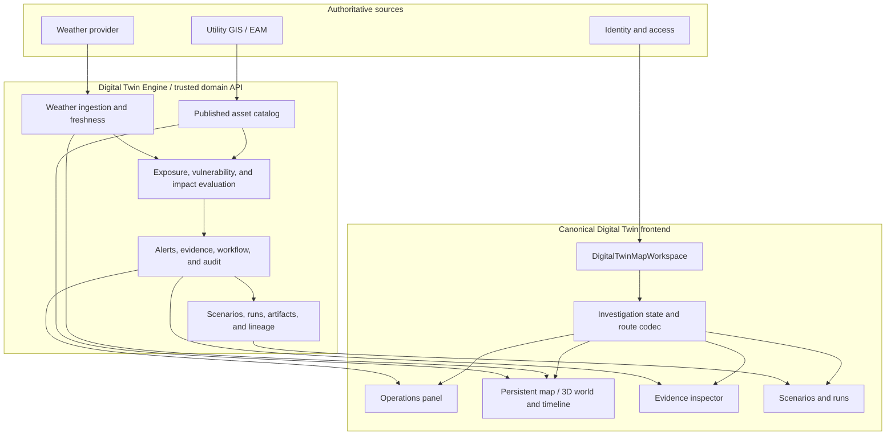
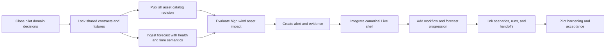

# Weather-to-Asset Impact Implementation Plan

| Field | Value |
| --- | --- |
| Status | Proposed execution plan |
| Implements | [Weather-to-Asset Impact Product Requirements](weather-asset-impact-prd.md) |
| UI contract | [Digital Twin Pilot UI Specification](digital-twin-ui-spec.md) |
| Initial slice | Boulder high-wind forecast to overhead-line alert investigation |
| Last reviewed | 2026-08-11 |

## 1. Outcome

Deliver one authoritative, end-to-end workflow in the currently routed Digital
Twin shell:

```text
forecast health -> developing high wind -> exposed line -> evaluated impact
-> durable alert -> evidence investigation -> acknowledgement/assignment
-> optional bounded scenario -> run/replay -> handoff
```

The plan intentionally grows the system in working layers. Each milestone ends
with a usable product slice and removes obsolete mock or duplicate paths as
their replacements become authoritative.

## 2. Current-state assessment

### 2.1 Foundations to keep

| Existing capability | Current role | Direction |
| --- | --- | --- |
| `DigitalTwinMapWorkspace` | Routed shell from `App.tsx`; owns top-level destinations and the map-first experience | Make canonical and compose Operations/Evidence into it. |
| `PersistentDigitalTwinMapHost` | Preserves the map across product destinations | Keep as the single world host. |
| `DigitalTwinHeader` and access boundary | Focused product navigation, region and role context | Connect to real monitoring and workflow state. |
| Power-line inventory client | Loads `/api/v1/regions/:regionId/power-lines` | Replace or subsume with the asset-catalog client. |
| Runs catalog and run detail | API-backed run list, artifacts, exposure, playback, and lineage foundations | Link to alerts/assets and use shared investigation state. |
| Scenario builder | Map-driven ignition selection and bounded inputs | Route and persist it; carry alert context; remove static scenario data. |
| Plan/3D map, overlays, and selection | Strong spatial foundation | Make asset identity and forecast time authoritative and shared. |

### 2.2 Gaps to close

| Gap | Current evidence | Required change |
| --- | --- | --- |
| Parallel workspace implementations | The routed `DigitalTwinMapWorkspace` and separate `DigitalTwinWorkspace`/`LiveView` both model the product | Extract useful Operations/Evidence components into the routed shell, then delete the duplicate path. |
| Mock operations truth | Routed shell includes static workspace assets, alerts, runs, alert count, and status copy; `LiveView` owns local alert state | Replace with explicit loading, empty, current, stale, partial, failed, and unauthorized states backed by APIs. |
| No operational asset catalog | Existing power-line response carries ID and two-point geometry; run exposure separately loads region GeoJSON | Add stable searchable assets, hierarchy, relationships, provenance, revisions, quality, and model-relevant attributes. |
| No alert/evidence API | The frontend has run APIs but no durable impact alert contract | Add Engine endpoints and typed clients for alerts, evidence, workflow, and forecast timeline. |
| Fragmented selection and routing | Map, runs, scenarios, and prototypes own local state; run URLs do not restore all time/view/selection state | Introduce one investigation state and a route codec. |
| Static scenarios | `ScenariosView` uses an in-file scenario collection | Add scenario persistence and remove the constant when the API path lands. |
| Client-side exposure inference in run detail | Run detail spatially intersects result and asset GeoJSON | Use Engine-owned affected-asset/evidence results for operational claims; retain client intersection only as a clearly labeled visual aid if still useful. |

The assessment is based on the current frontend files and tests. The codebase
graph excludes documentation and most tests by design, so those areas must
continue to be verified from source during implementation.

## 3. Architecture decisions

### AD-1: one canonical shell

`DigitalTwinMapWorkspace` remains the routed application shell. It owns the
persistent world, destination routing, shared investigation provider, and
contextual panel slots. Operations and Evidence become focused components, not
a second workspace application.

When the migrated components meet their acceptance tests:

- remove `DigitalTwinWorkspace`;
- remove the mock `LiveView` surface and its local alert model;
- remove its conditional path from `DesktopShell`; and
- remove obsolete styles, fixtures, and tests rather than add compatibility
  wrappers.

### AD-2: the Engine owns operational meaning

The Engine or trusted domain backend owns:

- weather normalization and freshness policy;
- exposure and vulnerability evaluation;
- potential impact, priority, and alert creation;
- evidence package construction and versioning;
- alert workflow state and audit;
- scenario execution, run results, and lineage; and
- authoritative affected-asset results.

The frontend owns interaction, selection, map presentation, filters, local form
drafts, accessibility, and explicit previews. It must not recreate domain risk
logic.

### AD-3: the asset catalog is an operational projection

The catalog service ingests or reads the approved asset system of record,
validates and publishes a region revision, and exposes only the identity,
geometry, relationships, quality, and impact-model attributes required by this
product. Authoritative edits remain in the source system.

### AD-4: shared investigation state is explicit

All surfaces read and update one state:

```ts
type InvestigationContext = "live" | "alert" | "scenario" | "run";

interface InvestigationState {
  regionId: string;
  context: InvestigationContext;
  contextId: string | null;
  selectedAssetId: string | null;
  selectedEvidenceId: string | null;
  selectedTime: string | null;
  viewMode: "plan" | "3d";
  evidenceSection: string | null;
}
```

The route is the durable, shareable projection of consequential state. The
provider may also contain transient UI state such as panel width or hover.

### AD-5: snapshots are authoritative; events accelerate

REST resources provide initial load and reconciliation after reconnect. Server
events or bounded polling may notify the frontend of alert, source, and
workflow changes. An event is never the only way to recover current truth.

### AD-6: use the existing component system

Use existing `@geolibre/ui` and shadcn primitives for panels, sheets, tabs,
tables, filters, menus, forms, tooltips, dialogs, and status presentation. New
product components use semantic tokens, shared glass surfaces, light/dark
themes, accessible focus, and reduced-motion behavior.

## 4. Target architecture



## 5. Proposed API surface

Field names are proposed until contract fixtures are agreed with the Engine.
All collection endpoints require authorization, region scoping, pagination,
and stable ordering. All timestamps are ISO 8601 with explicit zones.

### 5.1 Monitoring and forecast

| Method | Endpoint | Purpose |
| --- | --- | --- |
| GET | `/api/v1/regions/:regionId/monitoring-status` | Required source health, last success, freshness policy, active revision, and degraded reasons. |
| GET | `/api/v1/regions/:regionId/forecast-timeline` | Forecast issue, valid steps or intervals, horizon, gaps, provider and dataset revision. |
| GET | `/api/v1/regions/:regionId/hazards?validAt=...` | Hazard footprints and normalized values for the selected forecast time. |

### 5.2 Asset catalog

| Method | Endpoint | Purpose |
| --- | --- | --- |
| GET | `/api/v1/regions/:regionId/assets` | Paginated metadata; filters for query, type, status, bounding box, revision, and updated-since. |
| GET | `/api/v1/assets/:assetId` | Identity, hierarchy summary, provenance, quality, and impact attributes. |
| POST | `/api/v1/assets:batchGet` | Resolve alert and run asset IDs without N+1 requests. |
| GET | `/api/v1/assets/:assetId/relationships` | Parent, children, network neighbors, and related objects. |
| GET | `/api/v1/regions/:regionId/assets.geojson` or tiles | Viewport geometry for map presentation. |
| GET | `/api/v1/regions/:regionId/catalog-status` | Published revision, source revision, sync time, rejects, warnings, and completeness. |

The existing `/power-lines` endpoint is removed once catalog geometry and
metadata cover its consumers.

### 5.3 Alerts, evidence, and workflow

| Method | Endpoint | Purpose |
| --- | --- | --- |
| GET | `/api/v1/regions/:regionId/alerts` | Durable alert inbox with cursor, filters, counts, and stable order. |
| GET | `/api/v1/alerts/:alertId` | Alert detail, revision, affected asset IDs, geometry reference, and workflow state. |
| GET | `/api/v1/alerts/:alertId/evidence` | Versioned trigger, sources, evaluation, quality, caveats, and affected-asset evidence. |
| GET | `/api/v1/alerts/:alertId/activity` | Audit history and workflow events. |
| POST | `/api/v1/alerts/:alertId/acknowledgements` | Idempotent acknowledgement with actor and expected alert revision. |
| PATCH | `/api/v1/alerts/:alertId/assignment` | Assign or unassign with revision precondition. |
| POST | `/api/v1/alerts/:alertId/notes` | Add an immutable authored investigation note. |
| POST | `/api/v1/alerts/:alertId/handoffs` | Create a versioned handoff from selected evidence. |
| POST | `/api/v1/alerts/:alertId/resolution` | Record a disposition and resolve, subject to role and revision. |

### 5.4 Scenarios and runs

Keep the existing region, simulation-run, tick, result, and asset artifact
endpoints where they satisfy the contract. Add or refine:

| Method | Endpoint | Purpose |
| --- | --- | --- |
| GET/POST | `/api/v1/regions/:regionId/scenarios` | Persist and list bounded scenario definitions. |
| GET/PATCH | `/api/v1/scenarios/:scenarioId` | Load and update a draft subject to state and revision. |
| POST | `/api/v1/scenarios/:scenarioId/runs` | Submit a run with source alert/evidence references. |
| GET | `/api/v1/simulation-runs/:runId` | Include source alert, evidence, scenario, model, weather, asset revision, and progress lineage. |
| GET | `/api/v1/simulation-runs/:runId/exposure` | Engine-owned affected assets and contribution evidence. |

### 5.5 Error and revision conventions

- Use one problem-details shape with stable machine-readable codes.
- Return a revision or ETag on mutable workflow resources.
- Reject conflicting workflow mutations with the latest safe representation.
- Distinguish unauthorized, not found within scope, stale revision, unavailable
  dependency, invalid source data, and unsupported transition.
- Include request or correlation IDs for diagnostics without exposing private
  storage references.

## 6. Frontend module plan

The final names may follow local conventions, but concerns should remain
separate:

```text
product-modes/digital-twin/
  api/
    alerts.ts
    assets.ts
    monitoring.ts
    scenarios.ts
    runs.ts
    contracts.ts
  investigation/
    InvestigationProvider.tsx
    investigation-route.ts
    investigation-selection.ts
  live/
    LiveWorkspace.tsx
    OperationsPanel.tsx
    MonitoringStatus.tsx
    AlertInbox.tsx
    ForecastTimeline.tsx
    EvidenceInspector.tsx
    AffectedAssets.tsx
    WorkflowActions.tsx
  assets/
    AssetInspector.tsx
    AssetSearchResults.tsx
    AssetHierarchy.tsx
    CatalogDiagnostics.tsx
  ui/
    DigitalTwinMapWorkspace.tsx
    PersistentDigitalTwinMapHost.tsx
  views/
    ScenarioBuilder.tsx
    ScenariosView.tsx
    RunsView.tsx
    RunDetailView.tsx
```

API clients validate untrusted responses at the boundary and expose product
types to views. Server state, local form drafts, URL state, and map-renderer
state must not be combined into one monolithic component.

## 7. Delivery sequence

### Phase 0 — contract lock and shell seam

**Goal:** make the first vertical slice implementable without expanding mock
state.

Frontend:

- define alert, evidence, monitoring, asset, forecast, and workflow types;
- define validation rules and checked contract fixtures;
- add the investigation state and route codec;
- create panel slots in `DigitalTwinMapWorkspace` around the persistent map;
- define loading, empty, stale, partial, failed, and unauthorized state
  components; and
- add development fixtures only at explicit test or story boundaries.

Engine/data:

- close the seven PRD decisions for provider, asset unit, source of record,
  impact rule, quality policy, permissions, and operational target;
- publish example responses and error cases;
- choose revision, pagination, idempotency, and event semantics; and
- provide one deterministic Boulder test dataset.

Removal:

- stop adding features to `LiveView` and the duplicate workspace path;
- identify its reusable behavior as components, not as a surface to route.

Exit criteria:

- contract tests pass against shared fixtures;
- a deep link round-trips every investigation-state field;
- the canonical shell renders honest no-data and unavailable states; and
- the map host stays mounted while Operations and Evidence open and close.

### Phase 1 — source health and asset catalog

**Goal:** Live can truthfully answer whether inputs are current and identify
real assets before any alert is displayed.

Frontend:

- load monitoring and catalog status for the authorized region;
- replace hardcoded `Current`, update age, alert count, workspace assets, and
  region operational summaries;
- implement catalog search, viewport geometry loading, batch asset lookup,
  hierarchy, and asset inspector;
- connect map click and search to stable asset selection; and
- expose catalog revision, sync time, missing attributes, and geometry quality.

Engine/data:

- ingest and publish one Boulder catalog revision;
- expose assets, batch lookup, relationships, geometry delivery, and catalog
  diagnostics;
- ingest the chosen forecast source with issue, valid, retrieved, and quality
  times; and
- expose monitoring and forecast timeline snapshots.

Removal:

- remove `WORKSPACE_ASSETS` and region status placeholders;
- remove `/power-lines` after all consumers use the catalog contract.

Exit criteria:

- selecting a line by map, ID, or name yields the same catalog record;
- refreshing restores the region and selected asset;
- stale forecast or catalog data produces an explicit degraded state; and
- no production route substitutes sample assets or freshness text.

### Phase 2 — one real high-wind alert

**Goal:** the system produces and investigates one authoritative alert.

Frontend:

- build the Operations panel and server-backed alert inbox;
- add status, priority, hazard, ownership, time, and asset-type filters;
- focus alert footprint and affected lines in the world;
- add the Evidence inspector with trigger, lineage, model, quality, caveats,
  affected assets, and audit sections; and
- add alert-specific routes and restoration.

Engine/data:

- normalize the high-wind forecast into a hazard footprint and intensity;
- evaluate exposure plus the agreed vulnerability or impact policy;
- create one durable alert and versioned evidence package;
- return affected-asset contribution data; and
- preserve superseded forecast and evidence revisions.

Removal:

- remove `WORKSPACE_ALERTS`, the hardcoded alert count, and local alert
  mutation behavior from the routed shell;
- do not copy `INITIAL_ALERTS` into a new fixture used by production.

Exit criteria:

- the first six questions in the Live screen contract are answerable;
- all alert claims resolve to Engine evidence and stable asset IDs;
- the alert survives reload and is visible only to an authorized region; and
- no frontend code computes impact, threshold, priority, or vulnerability.

### Phase 3 — workflow and unified selection

**Goal:** an operator can own and coordinate the investigation.

Frontend:

- implement acknowledgement and assignment with optimistic feedback followed
  by authoritative reconciliation;
- add activity history and mutation conflict handling;
- synchronize alert, asset, evidence row, and map selection;
- complete permission-aware deep links; and
- preserve selection when moving between plan and 3D.

Engine:

- implement idempotent acknowledgement, revision-controlled assignment, audit
  events, and role enforcement; and
- expose current snapshots after conflicts or reconnects.

Removal:

- extract any still-useful Operations/Evidence presentation from `LiveView`;
- delete `LiveView`, `DigitalTwinWorkspace`, their obsolete CSS, and the
  duplicate `DesktopShell` route after equivalent tests pass.

Exit criteria:

- acknowledge and assign persist after refresh and across two clients;
- stale mutation conflicts are understandable and recoverable;
- a copied link restores alert, asset, evidence section, time, and view; and
- exactly one Digital Twin product shell remains.

### Phase 4 — forecast progression

**Goal:** the operator can understand what may happen across the forecast
horizon without confusing issue time and valid time.

Frontend:

- add the forecast timeline to the persistent world;
- load time-specific hazard and affected-asset states;
- update world, alert qualification, evidence, and labels atomically;
- show gaps, unavailable steps, issue changes, and horizon boundaries; and
- make timeline state restorable in the URL.

Engine:

- expose stable forecast steps or intervals and time-indexed evaluation
  results;
- define how alert identity behaves across forecast revisions; and
- provide supersession and gap semantics.

Exit criteria:

- the seventh Live question is answerable;
- every displayed overlay identifies its valid time and source revision;
- changing time cannot leave the map and evidence on different steps; and
- observed, forecast, and unavailable states are visually and semantically
  distinct.

### Phase 5 — scenario escalation, run linkage, and handoff

**Goal:** the operator can take the investigation further without blending
synthetic and monitored evidence.

Frontend:

- route and persist scenario creation;
- seed a scenario from the source alert, selected assets, evidence revision,
  and forecast context;
- label all synthetic inputs and results;
- link runs and replay back to their source alert and assets;
- use Engine-owned run exposure instead of operational client inference; and
- implement versioned handoff creation and review.

Engine:

- persist scenarios and source references;
- add alert/evidence/catalog lineage to run records;
- expose Engine-owned run exposure evidence; and
- persist handoff versions, disposition, ownership, and audit.

Removal:

- remove the static `SCENARIOS` collection and any route-local scenario
  identity;
- remove duplicate run/asset identity adapters made obsolete by the common
  contracts.

Exit criteria:

- the eighth and ninth Live questions are answerable;
- a scenario and run remain traceable to the original alert and evidence;
- monitored and synthetic layers cannot be mistaken for one another; and
- returning from a run or handoff restores the source investigation.

### Phase 6 — hardening and controlled expansion

**Goal:** make the pilot operable and add breadth through proven extension
points.

- conduct operator usability tests around the nine Live questions;
- run accessibility, resilience, security, and performance gates;
- load test alert, asset, forecast, and geometry pagination;
- validate source outage, stale catalog, forecast revision, partial evidence,
  conflict, reconnect, and clock-skew cases;
- instrument product and operational measures from the PRD; and
- add the next hazard or asset class only after its source, impact policy,
  evidence fields, quality states, and operator acceptance cases are defined.

Exit criteria:

- pilot acceptance scenario passes in the target deployment;
- production Live contains no sample operational truth;
- service objectives and incident ownership are documented; and
- a second hazard can reuse the contracts without changing the core shell or
  investigation model.

## 8. Workstreams and ownership boundaries

| Workstream | Primary responsibility | Critical deliverables |
| --- | --- | --- |
| Product/domain | Product owner with operations and engineering SMEs | Pilot policy decisions, terminology, priority semantics, caveat copy, acceptance. |
| Weather/data | Data engineering | Provider adapter, revision and time semantics, quality and freshness status. |
| Asset catalog | Data/platform engineering | Source mapping, stable IDs, hierarchy, published revisions, geometry and quality diagnostics. |
| Impact/alerts | Digital Twin Engine | Exposure/vulnerability evaluation, alert and evidence creation, lifecycle and audit APIs. |
| Frontend shell | Frontend | Canonical shell, investigation state, routes, panel composition, honest states. |
| Frontend world | Map/3D | Catalog geometry, selection, overlays, forecast timeline, persistent context. |
| Workflow | Engine and frontend | Acknowledge, assign, notes, disposition, handoff, conflicts and audit. |
| Scenario/run | Simulation and frontend | Source linkage, persisted scenarios, progress, replay, Engine-owned exposure. |
| Platform/security | Identity/platform | Organization and region enforcement, observability, performance, deployment readiness. |

## 9. Test strategy

### 9.1 Contract tests

- Validate every success and error fixture at the API-client boundary.
- Cover unknown enum values, missing required evidence, malformed geometry,
  pagination, revision conflicts, and inaccessible objects.
- Run shared fixtures against the Engine and frontend parser in CI.

### 9.2 Unit tests

- Route parsing and serialization.
- Investigation-state transitions.
- Freshness and display-state mapping using backend policy results, without
  recalculating policy.
- Selection synchronization and map focus.
- Alert filters and workflow transition availability.
- Time labels, issue/valid/retrieved semantics, and source-kind labels.

### 9.3 Integration tests

- Access resolution before protected content.
- Monitoring and catalog partial failure.
- Alert plus evidence plus batch asset resolution.
- Acknowledge/assign conflict and reconciliation.
- Forecast time change updating all consumers.
- Scenario creation and run linkage from an alert.

### 9.4 End-to-end tests

Automate the nine-step pilot acceptance scenario with deterministic Engine
fixtures. Add recovery cases for refresh, reconnect, stale event cursor,
superseded forecast, unavailable geometry, and expired authorization.

### 9.5 UI quality gates

- Keyboard traversal and screen-reader landmarks for Operations, world,
  timeline, Evidence, and actions.
- Visible focus and non-color state cues.
- Light and dark themes, portalled content, reduced motion, and zoom.
- Target workstation and narrower responsive layouts.
- Map continuity: panel, route, and destination changes must not remount or
  reset the world unexpectedly.

### 9.6 Performance and resilience tests

- Alert pages at expected and peak region volume.
- Catalog search, batch lookup, relationships, and viewport geometry at pilot
  scale and forecast growth.
- Timeline step changes with overlays and affected assets.
- 3D optional-data delay without blocking Live operations.
- Source outage and API timeout with preservation of qualified cached data.

## 10. Observability and operational readiness

Instrument without exposing asset or user data unnecessarily:

- source and catalog freshness status by region and revision;
- alert evaluation success, failure, and latency;
- evidence completeness and missing-field reasons;
- API latency, error code, pagination, and mutation conflict counts;
- event lag and snapshot reconciliation;
- frontend load, alert-open, evidence-open, asset-select, timeline-change,
  acknowledge, assign, scenario-launch, and deep-link-restore outcomes; and
- map/overlay load failures with provider and revision identifiers.

Provide a diagnostics surface for authorized roles and alerts for service
owners. User-facing health must be derived from the same source status as
operational monitoring, not from separate frontend timers.

## 11. Security and data controls

- Enforce organization, role, and region scope on every asset, alert, evidence,
  scenario, run, and handoff endpoint.
- Resolve authorization before returning labels, counts, geometry, or cached
  snapshots.
- Treat object-not-found within an unauthorized scope consistently to avoid
  leaking IDs.
- Use revision preconditions and audit actors for workflow mutation.
- Review exports and handoffs for private provider metadata and artifact paths.
- Threat-model deep links, event subscriptions, batch asset lookup, geometry
  delivery, and cross-region search.

## 12. Critical path



Frontend panel polish is not the critical path. The first major dependency is
agreement and delivery of authoritative forecast, asset, impact, and evidence
contracts. Frontend work before that point should focus on the canonical shell,
state, route codec, contract tests, and honest empty or degraded states.

## 13. Definition of done

The implementation is complete for the pilot only when:

- the PRD pilot acceptance scenario passes end to end against a deployed,
  authoritative Engine and published asset revision;
- `DigitalTwinMapWorkspace` is the only routed Digital Twin shell;
- the obsolete `DigitalTwinWorkspace`/`LiveView` path and static operational
  collections are removed;
- all operational claims come from versioned backend evidence;
- selection and time remain synchronized across Operations, world, Evidence,
  scenarios, and runs;
- acknowledgement and assignment are durable and audited;
- monitored and synthetic truth are persistently distinguishable;
- access, accessibility, resilience, performance, and security gates pass; and
- the documentation and API fixtures match the released behavior.

