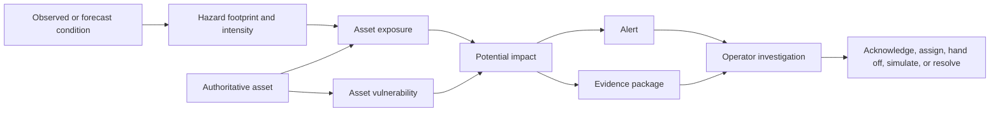

# Weather-to-Asset Impact Product Requirements

| Field | Value |
| --- | --- |
| Status | Draft for product, design, engineering, data, and pilot-operator alignment |
| Product | GeoLibre Digital Twin |
| Primary experience | Live weather-to-asset impact monitoring and alert investigation |
| Initial pilot | Boulder region, high-wind forecast, overhead line assets |
| Last reviewed | 2026-08-11 |
| Implementation | [Weather-to-Asset Impact Implementation Plan](weather-asset-impact-implementation-plan.md) |

## 1. Decision and document authority

GeoLibre Digital Twin is an operational decision-support product that monitors
observed and forecast environmental conditions against an authoritative asset
network, alerts operators to credible potential impacts, and provides the
spatial evidence and scenario tools needed to investigate, coordinate, and
hand off a response.

**Alert investigation is the main product.** The default Live screen is not a
general engineering editor, a collection of GIS tools, or a dashboard with a
decorative map. It is the authoritative place where an operator moves from a
developing condition to the assets that may be affected, the reason an alert
exists, the quality of its evidence, and the next human action.

This document narrows and clarifies the operational product direction in the
broader [Digital Twin Frontend Product Requirements](digital-twin-product-requirements.md).
The [Digital Twin Pilot UI Specification](digital-twin-ui-spec.md) remains the
detailed interaction and visual contract. If those documents are ambiguous
about the default product workflow, this focused PRD governs the weather-to-
asset impact experience.

The [Neara UI Research Report](research/neara-ui-research-report.md) is an input,
not a product template. GeoLibre should borrow Neara's model continuity,
spatial analysis, and stable asset-selection patterns without copying its dense
engineering-workspace shell.

## 2. Product definition

### 2.1 North star

> Show an operator what environmental conditions are developing, which assets
> may be affected, why the system raised an alert, how trustworthy the evidence
> is, what may happen next, and what human action has been taken.

### 2.2 Product promise

An authorized operator can open Live and answer, without entering an expert
engineering workspace:

1. Are monitoring and forecast sources current?
2. What conditions are developing?
3. Which assets could be affected?
4. Which alerts need attention?
5. Why was each alert generated?
6. How certain and complete is the evidence?
7. What might happen over the forecast horizon?
8. Has someone acknowledged, assigned, or investigated it?
9. Should it be handed off or simulated further?

### 2.3 Human decision boundary

The product provides decision support. It may display Engine-owned impact,
priority, and workflow state. It does not autonomously switch equipment,
de-energize lines, dispatch crews, issue public warnings, or present a modeled
result as an operational command.

## 3. Problem and opportunity

Utilities receive weather observations, forecasts, asset records, engineering
models, and simulation outputs from different systems. A person must currently
assemble the operational meaning: whether the sources are current, whether a
condition intersects the network, which assets are vulnerable, why an impact
is credible, and whether another person is already acting.

The existing GeoLibre frontend has strong foundations for this problem:

- a persistent 2D/3D world;
- direct asset selection and spatial overlays;
- scenario input and map interaction;
- API-backed simulation runs and replay; and
- a focused Digital Twin product shell.

The missing product layer is authoritative operational truth. The default Live
screen currently presents a map-oriented shell and sample operational content,
while a separate prototype contains richer Operations and Evidence panels.
Neither is yet a complete, Engine-backed weather-to-asset investigation flow.

The opportunity is to unify those surfaces around a single operational loop
and make the existing map, scenario, and replay capabilities serve it.

## 4. Users and jobs

### 4.1 Primary: grid or wildfire risk operator

Monitors assigned regions, investigates alerts, verifies evidence, coordinates
ownership, and hands credible concerns to an operational decision process.

Jobs:

- assess source health and current conditions;
- find new, worsening, and unowned alerts;
- identify affected assets in the network and world;
- understand the trigger, model, source, uncertainty, and caveats;
- acknowledge, assign, document, escalate, or resolve an alert; and
- launch a bounded scenario when more analysis is justified.

### 4.2 Secondary: supervisor

Reviews queue health, ownership, overdue work, dispositions, handoffs, and the
quality of operational decisions across one or more regions.

### 4.3 Secondary: engineer or analyst

Investigates asset geometry, vulnerability assumptions, model inputs, and run
results. May enter an explicitly authorized Expert GIS or engineering surface,
but returns evidence to the same alert and asset identities.

### 4.4 Supporting: administrator and data steward

Manages access, region scope, source configuration, publication health, asset
catalog ingestion, and diagnostics. This role does not manually manufacture
operational alerts in the Live UI.

## 5. Domain model and language

The product uses this causal chain:



| Concept | Definition |
| --- | --- |
| Asset | A stable, authoritative network object with identity, geometry, hierarchy, source revision, and the attributes required by impact models. |
| Observation | A measured environmental value with provider, location or footprint, observed time, received time, unit, and quality. |
| Forecast | A provider-issued prediction with issue time, validity interval, horizon, model or dataset version, and uncertainty when available. |
| Hazard | A normalized environmental condition, footprint, and intensity relevant to assets, such as high wind. |
| Exposure | The spatial and temporal intersection between a hazard and an asset. |
| Vulnerability | The Engine-owned relationship between an exposed asset's attributes and possible adverse outcomes. |
| Potential impact | The Engine's evaluated consequence or condition of concern for one or more assets. |
| Alert | A durable request for human attention created from an Engine-owned impact evaluation and evidence package. |
| Evidence package | The trigger values, sources, model and policy versions, affected assets, data quality, uncertainty, caveats, and audit references that explain an alert. |
| Scenario | Explicit, bounded, synthetic intent created by a user to test a what-if condition. It is never monitored truth. |
| Run | A durable Engine execution and its reproducible inputs, progress, outputs, lineage, and failures. |
| Handoff | A versioned record that communicates selected evidence and a human disposition to another role or process. |

## 6. Product principles

1. **Weather to assets to action.** Navigation and content follow the causal
   chain rather than the structure of backend services.
2. **The world is the shared investigation surface.** Alerts, assets, evidence,
   forecast time, scenarios, and runs use the same selection and spatial
   context.
3. **Evidence before conclusion.** Trigger values, units, sources, issue and
   validity times, model versions, completeness, uncertainty, and caveats are
   inspectable before an escalation action.
4. **Engine-owned operational truth.** The frontend does not calculate impact,
   vulnerability, alert priority, or thresholds.
5. **Monitored and synthetic truth never blend.** Forecast, observation, local
   preview, and Engine-validated scenario results have persistent labels and
   distinct presentation.
6. **One identity everywhere.** An asset selected from search, an alert, the
   map, a relationship, a scenario, or a run resolves to the same stable ID.
7. **Honest degraded states.** Unknown, stale, delayed, incomplete, failed, and
   unauthorized states replace invented freshness or reassuring sample data.
8. **Progressive expertise.** Operators receive a calm operational shell;
   engineers deliberately enter advanced workspaces.
9. **Human action is durable.** Acknowledgement, assignment, notes,
   disposition, handoff, and resolution are auditable server state.

## 7. Scope

### 7.1 First end-to-end pilot slice

The first release proves the whole loop with deliberately narrow breadth:

- one region: Boulder;
- one hazard: forecast high wind;
- one primary asset class: overhead line, corridor, or segment;
- one published asset-catalog revision;
- one Engine-owned impact rule or model;
- one real alert and evidence package;
- one forecast/impact overlay and affected-asset selection;
- one forecast timeline;
- acknowledgement and assignment;
- one permission-aware deep link; and
- optional launch of an existing bounded wildfire scenario from the alert.

This slice must work with authoritative data after reload. A broad collection
of mocked hazards and assets is not an acceptable substitute.

### 7.2 Following product breadth

After the pilot loop is trustworthy, add hazards and asset classes through the
same contracts. Candidate expansions include precipitation and flooding,
extreme heat, ice, wildfire proximity, vegetation or clearance conditions,
transformers, poles and structures, substations, conductor spans, and other
network assets. Each expansion needs a named source adapter, impact model or
policy, evidence schema, quality states, and operator validation.

### 7.3 Non-goals

- Recreating Neara's complete network-design, structural-analysis, LiDAR
  classification, formula, reporting, or capital-planning environment.
- Building a new system of record for utility assets.
- Editing authoritative network geometry from Live.
- Letting the frontend invent risk scores, threshold policy, or operational
  recommendations.
- Supporting every hazard before one vertical slice works end to end.
- Replacing the existing expert GeoLibre workspace.
- Autonomous equipment control, dispatch, evacuation, or public warning.

## 8. Functional requirements

Priorities are P0 for the first pilot loop, P1 for a complete operational
workflow, and P2 for expansion after validation.

### 8.1 Application shell and investigation state

| ID | Priority | Requirement |
| --- | --- | --- |
| SHELL-001 | P0 | The routed `DigitalTwinMapWorkspace` experience must be the single canonical Digital Twin shell. Operations and Evidence must be composed into it. |
| SHELL-002 | P0 | Live, Scenarios, and Runs must share the persistent map host rather than mount competing product frames. |
| SHELL-003 | P0 | Region, context, selected alert, selected asset, selected evidence, selected time, and plan/3D mode must form one investigation state. |
| SHELL-004 | P0 | Consequential investigation state must be restorable from a permission-aware URL. |
| SHELL-005 | P0 | The separate mock `DigitalTwinWorkspace`/`LiveView` product path must be removed after its useful components are migrated. No compatibility shell is required. |

### 8.2 Monitoring and forecast health

| ID | Priority | Requirement |
| --- | --- | --- |
| MON-001 | P0 | Live must show health for every source required by the active alert policy, including last successful observation or forecast retrieval. |
| MON-002 | P0 | Health states must include current, delayed, stale, unavailable, incomplete, and unknown with the governing freshness policy. |
| MON-003 | P0 | The UI must distinguish provider issue time, valid time, retrieval time, and frontend display time. |
| MON-004 | P0 | Missing or stale sources must visibly qualify affected alerts and must never be replaced by a hardcoded `Current` state. |
| MON-005 | P1 | Operators must be able to inspect source-level diagnostics and the last successful catalog or forecast revision. |

### 8.3 Authoritative asset catalog

The asset catalog is a P0 foundation. It is a read-only operational projection
from the utility's GIS, EAM, or other approved system of record, not a second
asset-management product.

| ID | Priority | Requirement |
| --- | --- | --- |
| CAT-001 | P0 | Every asset must have a stable authoritative ID, name or label, asset type, geometry or geometry reference, region, lifecycle status, source system, source revision, and last updated time. |
| CAT-002 | P0 | The catalog must expose hierarchy and relationships, initially region to circuit or corridor to line to segment or span to structure. |
| CAT-003 | P0 | It must expose the attributes required by the active impact model and identify required attributes that are missing. |
| CAT-004 | P0 | It must expose publication and quality state, including geometry quality and whether a record is authoritative, provisional, stale, or rejected. |
| CAT-005 | P0 | The frontend must support search by ID and name, map selection, batch lookup for alert asset IDs, viewport or bounding-box loading, and relationship traversal. |
| CAT-006 | P0 | The asset inspector must show identity, hierarchy, source revision, quality, impact-relevant attributes, related alerts, and related runs. |
| CAT-007 | P1 | Operators must be able to report a catalog data issue without editing authoritative fields. |
| CAT-008 | P1 | Catalog diagnostics must expose sync time, revision, rejected records, missing model inputs, and geometry failures. |

### 8.4 Alert inbox and lifecycle

| ID | Priority | Requirement |
| --- | --- | --- |
| ALT-001 | P0 | Live must show a durable, server-backed alert inbox scoped to the authorized region. |
| ALT-002 | P0 | Alerts must be filterable by workflow status, Engine-supplied priority, hazard, time, ownership, and affected asset type. |
| ALT-003 | P0 | Each alert must identify its hazard, validity interval, affected assets, current workflow state, owner, and evidence package. |
| ALT-004 | P0 | Opening an alert must focus its footprint and affected assets without losing the queue or evidence context. |
| ALT-005 | P0 | Acknowledgement and assignment must be durable, idempotent, access-controlled, and auditable. |
| ALT-006 | P1 | Notes, investigation state, disposition, escalation, handoff, resolution, and reopening must be durable and auditable. |
| ALT-007 | P1 | The UI must handle alerts that are superseded, no longer valid, or based on a revised forecast without deleting their history. |

### 8.5 Evidence and explanation

| ID | Priority | Requirement |
| --- | --- | --- |
| EVD-001 | P0 | Every alert must link to an immutable or versioned evidence package sufficient to explain why it was generated. |
| EVD-002 | P0 | Evidence must include the trigger condition, observed or forecast value, unit, comparison, threshold or policy reference, and validity interval. |
| EVD-003 | P0 | Evidence must identify source kind, provider, dataset revision, issue time, valid time, and retrieval time. |
| EVD-004 | P0 | Evidence must identify the impact model or policy name and version and the asset-catalog revision evaluated. |
| EVD-005 | P0 | Evidence quality must explicitly communicate completeness, fidelity, uncertainty when available, and approved caveats. |
| EVD-006 | P0 | The affected-asset list must explain each asset's contribution or relevant values when the Engine provides them. |
| EVD-007 | P0 | Selecting an evidence row, asset, or geometry must update the same selection in the world and inspector. |
| EVD-008 | P1 | Operators must be able to compare a superseding evidence package without losing the original alert record. |

### 8.6 World, overlays, and time

| ID | Priority | Requirement |
| --- | --- | --- |
| MAP-001 | P0 | The map or 3D scene must remain the largest investigation surface and preserve camera context as panels open or close. |
| MAP-002 | P0 | Hazard footprint, affected assets, selected asset, and alert geometry must be separately identifiable without relying on color alone. |
| MAP-003 | P0 | Map click, search, alert selection, asset list, and evidence table must share one selected asset identity. |
| MAP-004 | P0 | A forecast timeline must show issue time, current valid time, horizon, available steps, and gaps. |
| MAP-005 | P0 | Scrubbing forecast time must update overlays, affected assets, alert evidence, and labels atomically for the selected time. |
| MAP-006 | P0 | Observed, forecast, synthetic preview, and Engine-validated run layers must have persistent source labels. |
| MAP-007 | P1 | Plan and 3D modes must preserve the same alert, asset, evidence, and time selection. |

### 8.7 Scenario, run, and handoff

| ID | Priority | Requirement |
| --- | --- | --- |
| SCN-001 | P0 | An operator may launch a bounded scenario from an alert with the alert, region, asset selection, evidence version, and forecast context carried forward explicitly. |
| SCN-002 | P0 | Synthetic inputs must be labeled before submission and in every resulting run view. |
| SCN-003 | P0 | Engine-validated run outputs must retain full input and model lineage and remain linked to the source alert. |
| SCN-004 | P1 | A handoff must contain a versioned evidence selection, human summary, disposition, owner or target, and audit history. |
| SCN-005 | P1 | Returning from a scenario, run, or handoff must restore the source investigation context. |

### 8.8 Search, access, and diagnostics

| ID | Priority | Requirement |
| --- | --- | --- |
| OPS-001 | P0 | Search must return authorized assets, alerts, regions, scenarios, and runs with type and region context. |
| OPS-002 | P0 | Protected labels, geometry, counts, and cached content must not render before access and region scope resolve. |
| OPS-003 | P0 | Empty, loading, unavailable, stale, partial, failed, unauthorized, and no-match states must be distinct. |
| OPS-004 | P0 | The frontend must recover authoritative investigation and workflow state after refresh or reconnect. |
| OPS-005 | P1 | Diagnostics must show API reachability, source health, catalog revision, event freshness, and client/server time skew. |

## 9. Live screen contract

The desktop Live screen has four coordinated areas:

1. **Operations panel:** source summary, alert inbox, filters, ownership, and
   activity.
2. **Persistent world:** plan or 3D view, weather and impact overlays, selected
   assets, map controls, and forecast timeline.
3. **Evidence inspector:** summary, trigger, affected assets, weather lineage,
   model and policy, quality, caveats, audit, and next actions.
4. **Status footer:** decision-support boundary, freshness qualification, and
   access to diagnostics.

Panels may collapse or resize, but they remain contextual lenses over the same
region, selection, and time. The product must not embed a second application
frame inside the world.

Detailed dimensions, responsive behavior, content hierarchy, keyboard
behavior, and visual styling are governed by the
[Digital Twin Pilot UI Specification](digital-twin-ui-spec.md).

## 10. Proposed product contracts

These contracts describe required product meaning. The implementation plan may
refine field names before the first contract test is locked.

### 10.1 Impact alert

```ts
interface ImpactAlert {
  id: string;
  regionId: string;
  title: string;
  hazardType: string;
  status: "new" | "acknowledged" | "investigating" | "handed_off" | "resolved";
  priority: string; // Engine supplied; the frontend does not derive it.
  detectedAt: string;
  validFrom: string;
  validUntil: string;
  affectedAssetIds: string[];
  geometryRef: string | null;
  evidencePackageId: string;
  assignedTo: string | null;
  revision: string;
}
```

### 10.2 Alert evidence

```ts
interface AlertEvidence {
  id: string;
  alertId: string;
  trigger: {
    condition: string;
    value: number | string;
    unit: string;
    comparison: string;
    threshold: number | string;
  };
  weather: {
    kind: "observed" | "forecast" | "synthetic";
    provider: string;
    datasetVersion: string;
    issuedAt: string | null;
    validFrom: string;
    validUntil: string;
    retrievedAt: string;
  };
  evaluation: {
    modelName: string;
    modelVersion: string;
    policyVersion: string;
    assetCatalogRevision: string;
    method: string;
  };
  quality: {
    completeness: "complete" | "partial" | "unknown";
    fidelity: string;
    uncertainty: string | null;
    caveats: string[];
  };
  affectedAssets: Array<{
    assetId: string;
    contribution: string | null;
    values: Record<string, number | string | null>;
  }>;
}
```

### 10.3 Shared investigation state

```ts
interface InvestigationState {
  regionId: string;
  context: "live" | "alert" | "scenario" | "run";
  contextId: string | null;
  selectedAssetId: string | null;
  selectedEvidenceId: string | null;
  selectedTime: string | null;
  viewMode: "plan" | "3d";
  evidenceSection: string | null;
}
```

A representative deep link is:

```text
/regions/boulder-co/alerts/alert-123?asset=line-42&time=2026-08-11T21%3A00%3A00Z&view=plan&section=evidence
```

## 11. Non-functional requirements

### 11.1 Reliability and consistency

- Server responses and revisions are authoritative after reload.
- Workflow mutations are idempotent or protected by revision preconditions.
- Partial service failure must preserve already loaded evidence while clearly
  marking it stale or incomplete.
- REST snapshot reconciliation is required even if live events are added.
- All timestamps use explicit zones and display the operator's zone alongside
  source issue and validity semantics.

### 11.2 Performance

- Live shell and current region status must become usable before optional 3D
  datasets finish loading.
- Alert and asset lists use server pagination or cursoring.
- Large asset geometry uses viewport, tile, or bounded-query delivery rather
  than loading the entire utility network as one document.
- Time changes must avoid remounting the persistent map host.

### 11.3 Accessibility

- All actions and panel controls are keyboard operable with visible focus.
- Priority, quality, source kind, and state never rely on color alone.
- Maps have parallel list and inspector access to required facts.
- Animations respect reduced motion; new alerts do not flash or pulse
  indefinitely.
- Loading and mutation results are announced appropriately.

### 11.4 Security and privacy

- Organization and region scope are enforced by the trusted backend, not only
  hidden in the frontend.
- Deep links are access checked before protected content renders.
- Evidence and audit exports exclude private artifact paths and unauthorized
  records.
- Mutation audit records include actor, action, time, object, and revision.

## 12. Success measures

### 12.1 Pilot outcome measures

- Median time from opening an alert to identifying its affected asset and
  trigger.
- Percentage of alerts opened with complete source, model, and asset lineage.
- Percentage of active alerts with an owner and acknowledgement within the
  pilot's agreed operational target.
- Percentage of deep links that restore the same authorized alert, asset,
  time, and view.
- Number of false freshness or unsupported certainty presentations: target 0.
- Percentage of scenario runs traceable to their source alert and evidence
  revision.

### 12.2 Product quality measures

- No sample alert, count, asset, or freshness statement appears in a production
  Live state.
- No frontend-generated risk score, threshold, or operational recommendation.
- Contract, integration, accessibility, and end-to-end coverage for the pilot
  journey.
- Operator usability testing demonstrates that the nine Live questions can be
  answered without entering Expert GIS.

## 13. Pilot acceptance scenario

The pilot is acceptable when an authorized Boulder operator can:

1. Open Live and see the actual health and freshness of required forecast and
   asset sources.
2. Open a real Engine-generated high-wind alert.
3. See the forecast footprint and affected overhead line in the world.
4. Select that line from the map, alert, search, or affected-assets list and
   receive the same stable asset identity and inspector.
5. Read the trigger value and unit, threshold or policy, provider and forecast
   revision, issue and valid times, impact model version, catalog revision,
   completeness, uncertainty, and caveats.
6. Scrub the available forecast horizon and see the world and evidence update
   to the same valid time.
7. Copy a link that restores the authorized alert, asset, time, view, and
   evidence section.
8. Acknowledge and assign the alert, refresh, and observe the same audited
   server state.
9. Launch a bounded scenario carrying the alert context while seeing an
   unmistakable distinction between monitored and synthetic inputs.

## 14. Dependencies, risks, and open decisions

### Dependencies

- An Engine-owned alert and evidence evaluation contract.
- A published operational asset-catalog projection and revision policy.
- At least one forecast source with issue, validity, retrieval, and quality
  metadata.
- Identity, organization, role, and region authorization.
- Stable relationships between alert, asset, scenario, run, and handoff IDs.

### Primary risks

| Risk | Response |
| --- | --- |
| Building UI faster than authoritative contracts | Lock one contract-tested vertical slice before adding hazard breadth. |
| Treating GIS overlap as impact | Require an Engine-owned vulnerability and impact evaluation; exposure alone is not an alert. |
| Poor asset data undermines credibility | Make catalog revision, missing attributes, and geometry quality visible and block evaluation where policy requires. |
| Forecast revisions confuse operators | Preserve issue and valid time, version evidence packages, and show supersession explicitly. |
| Parallel shells continue to diverge | Make the routed map workspace canonical and delete the duplicate product path after migration. |
| Scenario results appear operational | Persist source-kind labels and never replace monitored evidence with synthetic results. |
| The shell becomes an expert engineering IDE | Keep advanced editing and analysis behind explicit Expert GIS access. |

### Decisions to close before Phase 1 contract lock

1. Which forecast provider and dataset power the Boulder high-wind pilot?
2. What exact asset unit is evaluated: line, corridor, segment, or span?
3. Which system is authoritative for asset identity and hierarchy?
4. What Engine rule or model creates the first impact alert?
5. What freshness and completeness policy blocks or qualifies an alert?
6. Which roles may acknowledge, assign, resolve, and hand off?
7. What operational target, if any, governs acknowledgement and ownership?

